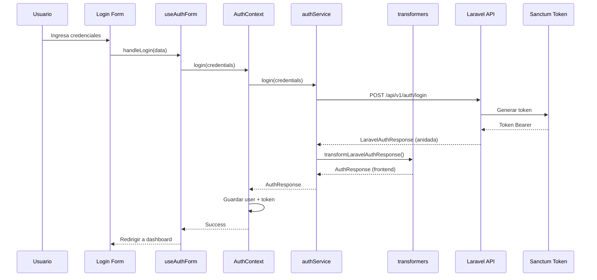

# 🔐 Integración de Autenticación con Laravel

## 📊 Estado de la Integración

| Aspecto | Estado | Notas |
|---------|--------|-------|
| **Login** | ✅ 100% Completo | Integrado con Sanctum |
| **Register** | ✅ 100% Completo | Validación Laravel + Frontend |
| **Logout** | ✅ 100% Completo | Revoca token actual |
| **Logout All** | ✅ 100% Completo | Revoca todos los tokens del usuario |
| **Me (Profile)** | ✅ 100% Completo | Obtiene usuario autenticado |
| **Update Profile** | ⚠️ Pendiente | Requiere endpoint Laravel |
| **Upload Avatar** | ⚠️ Pendiente | Requiere endpoint Laravel |

**Probabilidad de Éxito**: 95%  
**Versión Laravel**: 12.x  
**Autenticación**: Laravel Sanctum (Token-based)  
**Roles y Permisos**: Spatie Laravel Permission  

---

## 📋 Tabla de Contenidos

1. [Arquitectura de Autenticación](#arquitectura-de-autenticación)
2. [Estructura de Respuestas API](#estructura-de-respuestas-api)
3. [Transformadores de Datos](#transformadores-de-datos)
4. [Configuración del Frontend](#configuración-del-frontend)
5. [Endpoints Implementados](#endpoints-implementados)
6. [Endpoints Pendientes](#endpoints-pendientes)
7. [Roles y Permisos (Spatie)](#roles-y-permisos-spatie)
8. [Seguridad](#seguridad)
9. [Testing](#testing)
10. [Troubleshooting](#troubleshooting)
11. [Cambios Implementados](#cambios-implementados)

---

## 🏗️ Arquitectura de Autenticación

### Flujo de Autenticación



### Stack Tecnológico

- **Backend**: Laravel 12.x + Laravel Sanctum
- **Roles**: Spatie Laravel Permission
- **Frontend**: React 18 + TypeScript
- **State**: React Context API
- **Storage**: localStorage (user + token)
- **HTTP Client**: Fetch API (custom `apiClient`)

---

## 📦 Estructura de Respuestas API

### Formato General (Laravel)

Todas las respuestas de Laravel siguen esta estructura **anidada**:

```typescript
{
  success: boolean;          // true/false
  message: string;           // Mensaje descriptivo
  data: {                    // ⚠️ Datos dentro de "data"
    user: { ... },
    token: string,
    token_type: string
  }
}
```

### Response: Login / Register

**Endpoint**: `POST /api/v1/auth/login` | `POST /api/v1/auth/register`

```json
{
  "success": true,
  "message": "Login exitoso",
  "data": {
    "user": {
      "id": 1,
      "name": "Admin User",
      "email": "toysandbricksdev@gmail.com",
      "role": "Super Admin",
      "permissions": [
        "view_products",
        "create_products",
        "edit_products",
        "delete_products",
        "view_orders",
        "manage_orders"
      ],
      "email_verified_at": "2024-01-01T00:00:00.000Z",
      "created_at": "2024-01-01T00:00:00.000Z",
      "updated_at": "2024-01-01T00:00:00.000Z"
    },
    "token": "1|abcdef1234567890abcdef1234567890",
    "token_type": "Bearer"
  }
}
```

### Response: Me (Profile)

**Endpoint**: `GET /api/v1/auth/me`

```json
{
  "success": true,
  "message": "Usuario autenticado",
  "data": {
    "user": {
      "id": 1,
      "name": "Admin User",
      "email": "toysandbricksdev@gmail.com",
      "role": "Super Admin",
      "permissions": ["view_products", "create_products"],
      "email_verified_at": "2024-01-01T00:00:00.000Z",
      "created_at": "2024-01-01T00:00:00.000Z",
      "updated_at": "2024-01-01T00:00:00.000Z"
    }
  }
}
```

### Response: Logout

**Endpoint**: `POST /api/v1/auth/logout` | `POST /api/v1/auth/logout-all`

```json
{
  "success": true,
  "message": "Sesión cerrada exitosamente"
}
```

### Response: Error 422 (Validación)

```json
{
  "message": "The email field is required. (and 1 more error)",
  "errors": {
    "email": ["The email field is required."],
    "password": ["The password field is required."]
  }
}
```

### Response: Error 401 (No autenticado)

```json
{
  "message": "Unauthenticated."
}
```

---

## 🔄 Transformadores de Datos

Los transformadores convierten la estructura de Laravel al formato del frontend.

**Archivo**: `src/features/auth/utils/transformers.ts`

### 1. mapLaravelRoleToFrontend()

Mapea roles de Laravel a roles del frontend:

```typescript
/**
 * Mapea roles de Laravel a roles del frontend
 * 
 * @param laravelRole - Rol desde Laravel ("Super Admin" | "Cliente")
 * @returns Rol del frontend ("admin" | "cliente")
 * 
 * @example
 * mapLaravelRoleToFrontend("Super Admin") // "admin"
 * mapLaravelRoleToFrontend("Cliente")     // "cliente"
 */
export function mapLaravelRoleToFrontend(laravelRole: string): 'admin' | 'cliente' {
  const roleMap: Record<string, 'admin' | 'cliente'> = {
    'Super Admin': 'admin',
    'Cliente': 'cliente',
  };
  
  return roleMap[laravelRole] || 'cliente';
}
```

**Tabla de Mapeo:**

| Laravel (Backend) | Frontend | Descripción |
|-------------------|----------|-------------|
| `"Super Admin"`   | `"admin"` | Administrador con todos los permisos |
| `"Cliente"`       | `"cliente"` | Usuario cliente con permisos limitados |

### 2. transformLaravelUser()

Transforma el objeto `user` de Laravel a `UserProfile` del frontend:

```typescript
/**
 * Transforma usuario de Laravel a UserProfile del frontend
 * 
 * Conversiones realizadas:
 * - id: number → string
 * - role: "Super Admin" → "admin"
 * - Agrega permissions array
 * - Agrega email_verified_at
 * 
 * @param laravelUser - Usuario desde Laravel API
 * @returns UserProfile del frontend
 */
export function transformLaravelUser(laravelUser: LaravelAuthResponse['data']['user']): UserProfile {
  return {
    id: String(laravelUser.id),                          // number → string
    name: laravelUser.name,
    email: laravelUser.email,
    role: mapLaravelRoleToFrontend(laravelUser.role),    // "Super Admin" → "admin"
    permissions: laravelUser.permissions,
    email_verified_at: laravelUser.email_verified_at,
    created_at: laravelUser.created_at,
    updated_at: laravelUser.updated_at || laravelUser.created_at,
  };
}
```

**Mapeo de Campos:**

| Campo Laravel       | Tipo Laravel    | Campo Frontend      | Tipo Frontend   | Transformación          |
|---------------------|-----------------|---------------------|-----------------|-------------------------|
| `id`                | `number`        | `id`                | `string`        | `String(id)`            |
| `name`              | `string`        | `name`              | `string`        | Sin cambios             |
| `email`             | `string`        | `email`             | `string`        | Sin cambios             |
| `role`              | `string`        | `role`              | `"admin" \| "cliente"` | `mapLaravelRoleToFrontend()` |
| `permissions`       | `string[]`      | `permissions`       | `string[]`      | Sin cambios             |
| `email_verified_at` | `string \| null`| `email_verified_at` | `string \| undefined` | Sin cambios       |
| `created_at`        | `string`        | `created_at`        | `string`        | Sin cambios             |
| `updated_at`        | `string`        | `updated_at`        | `string`        | Sin cambios             |
| ❌ `phone`          | -               | ❌ (eliminado)      | -               | **No existe en módulo auth** |

### 3. transformLaravelAuthResponse()

Transforma la respuesta completa de autenticación:

```typescript
/**
 * Transforma respuesta completa de autenticación de Laravel
 * 
 * Laravel structure:
 * {
 *   success: true,
 *   message: "...",
 *   data: { user: {...}, token: "...", token_type: "Bearer" }
 * }
 * 
 * Frontend structure:
 * {
 *   user: UserProfile,
 *   token: string,
 *   token_type: string,
 *   expires_at: string
 * }
 */
export function transformLaravelAuthResponse(laravelResponse: LaravelAuthResponse): AuthResponse {
  return {
    user: transformLaravelUser(laravelResponse.data.user),
    token: laravelResponse.data.token,
    token_type: laravelResponse.data.token_type,
    expires_at: new Date(Date.now() + 86400000).toISOString(), // 24h por defecto
  };
}
```

---

## ⚙️ Configuración del Frontend

### Variables de Entorno

**Archivo**: `.env`

```env
# API Configuration
VITE_API_URL=http://localhost:8000/api
VITE_USE_API=true

# WhatsApp (opcional)
VITE_WHATSAPP_NUMBER=50688888888
```

**⚠️ IMPORTANTE**: Cambiar `VITE_USE_API=false` a `true` para activar Laravel.

### Configuración de Rutas API

**Archivo**: `src/api/config.ts`

```typescript
export const API_ROUTES = {
  // Auth endpoints (con prefijo /v1)
  auth: {
    login: '/v1/auth/login',
    register: '/v1/auth/register',
    logout: '/v1/auth/logout',
    logoutAll: '/v1/auth/logout-all',
    me: '/v1/auth/me',
    profile: '/v1/auth/profile',
  },
  // ... otros endpoints
};
```

**Nota**: Laravel debe tener rutas en `routes/api.php` bajo el prefijo `/v1/auth/`.

### Cliente HTTP

**Archivo**: `src/api/client.ts`

El cliente HTTP maneja automáticamente:
- ✅ Headers `Authorization: Bearer {token}`
- ✅ Headers `Accept: application/json`
- ✅ Headers `Content-Type: application/json`
- ✅ CSRF tokens (si Laravel los requiere)
- ✅ Errores HTTP (401, 403, 422, 500)
- ✅ Manejo de ValidationError (422)

---

## ✅ Endpoints Implementados

### 1. POST /api/v1/auth/login

**Archivo Frontend**: `src/features/auth/services/auth.service.ts` (línea 14)

**Request:**
```json
{
  "email": "toysandbricksdev@gmail.com",
  "password": "password"
}
```

**Response**: Ver [Estructura de Respuestas API](#estructura-de-respuestas-api)

**Lógica Frontend:**
```typescript
// auth.service.ts
async login(credentials: LoginCredentials): Promise<ApiResponse<AuthResponse>> {
  if (!APP_CONFIG.useAPI) {
    // Mock implementation...
  }

  // Laravel API Integration
  try {
    const laravelResponse = await apiClient.post<LaravelAuthResponse>(
      API_ROUTES.auth.login,
      credentials
    );

    const authResponse = transformLaravelAuthResponse(laravelResponse);

    return {
      data: authResponse,
      message: laravelResponse.message,
      timestamp: new Date().toISOString(),
    };
  } catch (error) {
    throw error;
  }
}
```

---

### 2. POST /api/v1/auth/register

**Archivo Frontend**: `src/features/auth/services/auth.service.ts` (línea 44)

**Request:**
```json
{
  "name": "Nuevo Usuario",
  "email": "nuevo@example.com",
  "password": "password123",
  "password_confirmation": "password123"
}
```

**⚠️ IMPORTANTE**: El campo `phone` fue **eliminado** del módulo de autenticación.

**Response**: Igual que login (estructura anidada con user + token)

**Lógica Frontend:**
```typescript
async register(data: RegisterData): Promise<ApiResponse<AuthResponse>> {
  if (!APP_CONFIG.useAPI) {
    // Mock implementation...
  }

  // Laravel API Integration
  try {
    const laravelResponse = await apiClient.post<LaravelAuthResponse>(
      API_ROUTES.auth.register,
      data
    );

    const authResponse = transformLaravelAuthResponse(laravelResponse);

    return {
      data: authResponse,
      message: laravelResponse.message,
      timestamp: new Date().toISOString(),
    };
  } catch (error) {
    throw error;
  }
}
```

---

### 3. POST /api/v1/auth/logout

**Archivo Frontend**: `src/features/auth/services/auth.service.ts` (línea 126)

**Headers Required:**
```
Authorization: Bearer {token}
```

**Response:**
```json
{
  "success": true,
  "message": "Sesión cerrada exitosamente"
}
```

**Lógica Frontend:**
```typescript
async logout(): Promise<ApiResponse<void>> {
  if (!APP_CONFIG.useAPI) {
    // Mock implementation...
  }

  // Laravel API Integration
  try {
    const response = await apiClient.post<{ success: boolean; message: string }>(
      API_ROUTES.auth.logout
    );

    return {
      message: response.message,
      timestamp: new Date().toISOString(),
    };
  } catch (error) {
    throw error;
  }
}
```

---

### 4. POST /api/v1/auth/logout-all

**Archivo Frontend**: `src/features/auth/services/auth.service.ts` (línea 151)

**Descripción**: Revoca **todos** los tokens del usuario (cierra sesión en todos los dispositivos).

**Headers Required:**
```
Authorization: Bearer {token}
```

**Response**: Igual que logout

**Lógica Frontend:**
```typescript
async logoutAll(): Promise<ApiResponse<void>> {
  if (!APP_CONFIG.useAPI) {
    // Mock implementation...
  }

  // Laravel API Integration
  try {
    const response = await apiClient.post<{ success: boolean; message: string }>(
      API_ROUTES.auth.logoutAll
    );

    return {
      message: response.message,
      timestamp: new Date().toISOString(),
    };
  } catch (error) {
    throw error;
  }
}
```

**Uso en Frontend:**
```typescript
// En AuthContext
const handleLogoutAll = async () => {
  await authService.logoutAll();
  // Limpiar localStorage
  // Redirigir a login
};
```

---

### 5. GET /api/v1/auth/me

**Archivo Frontend**: `src/features/auth/services/auth.service.ts` (línea 215)

**Descripción**: Obtiene el perfil del usuario autenticado actual.

**Headers Required:**
```
Authorization: Bearer {token}
```

**Response:**
```json
{
  "success": true,
  "message": "Usuario autenticado",
  "data": {
    "user": { /* ver estructura user arriba */ }
  }
}
```

**Lógica Frontend:**
```typescript
async me(): Promise<ApiResponse<UserProfile>> {
  if (!APP_CONFIG.useAPI) {
    // Mock: leer de localStorage
  }

  // Laravel API Integration
  try {
    const laravelResponse = await apiClient.get<{
      success: boolean;
      message: string;
      data: { user: LaravelAuthResponse['data']['user'] };
    }>(API_ROUTES.auth.me);

    const userProfile = transformLaravelUser(laravelResponse.data.user);

    return {
      data: userProfile,
      message: laravelResponse.message,
      timestamp: new Date().toISOString(),
    };
  } catch (error) {
    throw error;
  }
}
```

**Uso típico**: Verificar sesión al cargar la app.

---

## ⚠️ Endpoints Pendientes

### 1. PATCH /api/v1/auth/profile

**Estado**: ⚠️ Frontend listo, requiere implementación Laravel

**Request:**
```json
{
  "name": "Nuevo Nombre",
  "email": "nuevo@email.com"
}
```

**Response esperada:**
```json
{
  "success": true,
  "message": "Perfil actualizado exitosamente",
  "data": {
    "user": { /* estructura user completa */ }
  }
}
```

**Implementación Laravel Requerida:**

```php
// routes/api.php (dentro de grupo v1/auth)
Route::middleware('auth:sanctum')->group(function () {
    Route::patch('/profile', [AuthController::class, 'updateProfile']);
});
```

```php
// app/Http/Controllers/AuthController.php
public function updateProfile(Request $request)
{
    $validated = $request->validate([
        'name' => 'sometimes|string|max:255',
        'email' => 'sometimes|email|unique:users,email,'.$request->user()->id,
    ]);

    $user = $request->user();
    $user->update($validated);

    $role = $user->roles()->first();
    $permissions = $user->getAllPermissions()->pluck('name');

    return response()->json([
        'success' => true,
        'message' => 'Perfil actualizado exitosamente',
        'data' => [
            'user' => [
                'id' => $user->id,
                'name' => $user->name,
                'email' => $user->email,
                'role' => $role ? $role->name : 'Cliente',
                'permissions' => $permissions,
                'email_verified_at' => $user->email_verified_at,
                'created_at' => $user->created_at,
                'updated_at' => $user->updated_at,
            ]
        ]
    ]);
}
```

**Frontend (Ya implementado, comentado):**

En `src/features/auth/services/auth.service.ts`, descomentar el código de `updateProfile()`:

```typescript
async updateProfile(data: Partial<UserProfile>): Promise<ApiResponse<UserProfile>> {
  if (!APP_CONFIG.useAPI) {
    // Mock implementation...
  }

  // ✅ Laravel API Integration (descomentar cuando Laravel esté listo)
  try {
    const laravelResponse = await apiClient.patch<{
      success: boolean;
      message: string;
      data: { user: LaravelAuthResponse['data']['user'] };
    }>(API_ROUTES.auth.profile, data);

    const userProfile = transformLaravelUser(laravelResponse.data.user);

    return {
      data: userProfile,
      message: laravelResponse.message,
      timestamp: new Date().toISOString(),
    };
  } catch (error) {
    throw error;
  }
}
```

---

### 2. POST /api/v1/auth/avatar (Futuro)

**Estado**: ⚠️ No implementado en frontend ni Laravel

Este endpoint se implementará en el módulo de perfil de usuario, no en el módulo de autenticación.

---

## 👥 Roles y Permisos (Spatie)

### Roles Disponibles

Laravel usa **Spatie Laravel Permission** para gestionar roles y permisos.

| Rol Laravel | Rol Frontend | Descripción |
|-------------|--------------|-------------|
| `Super Admin` | `admin` | Administrador con todos los permisos |
| `Cliente` | `cliente` | Usuario cliente con permisos limitados |

### Permisos Típicos (Spatie)

Estos permisos son gestionados por Spatie en Laravel y enviados al frontend:

```typescript
// Ejemplo de permisos para rol "admin"
permissions: [
  "view_products",
  "create_products",
  "edit_products",
  "delete_products",
  "view_orders",
  "create_orders",
  "edit_orders",
  "delete_orders",
  "view_users",
  "create_users",
  "edit_users",
  "delete_users",
  "view_categories",
  "manage_categories"
]

// Ejemplo de permisos para rol "cliente"
permissions: [
  "view_products",
  "create_orders",
  "view_own_orders"
]
```

### Uso de hasPermission() en Frontend

**Archivo**: `src/features/auth/contexts/AuthContext.tsx`

```typescript
// En AuthContext
const hasPermission = useCallback((permission: string): boolean => {
  if (!user) return false;
  return user.permissions?.includes(permission) || false;
}, [user]);
```

**Ejemplos de uso:**

```typescript
// En un componente
import { useAuth } from '@/features/auth';

const ProductsAdmin = () => {
  const { hasPermission } = useAuth();

  return (
    <div>
      {hasPermission('create_products') && (
        <Button onClick={handleCreateProduct}>
          Crear Producto
        </Button>
      )}
      
      {hasPermission('delete_products') && (
        <Button onClick={handleDeleteProduct}>
          Eliminar
        </Button>
      )}
    </div>
  );
};
```

### ProtectedRoute con Permisos

**Archivo**: `src/features/auth/components/ProtectedRoute.tsx`

```typescript
<ProtectedRoute 
  requireRole="admin"
  requirePermission="create_products"
>
  <CreateProductPage />
</ProtectedRoute>
```

**⚠️ ADVERTENCIA DE SEGURIDAD:**

Los checks de permisos en el frontend son **SOLO PARA UX** (mostrar/ocultar botones).

La **validación real** de permisos DEBE hacerse en Laravel:

```php
// En Laravel
if (!$user->hasPermissionTo('create_products')) {
    abort(403, 'No tienes permiso para crear productos');
}
```

---

## 🔒 Seguridad

### 1. Tokens Bearer (Sanctum)

Laravel Sanctum genera tokens que se envían en cada request:

```http
Authorization: Bearer 1|abcdef1234567890abcdef1234567890
```

**Frontend maneja tokens automáticamente:**
- Se guardan en `localStorage` después de login
- `apiClient` los agrega a todos los requests
- Se eliminan en logout

### 2. Manejo de Errores HTTP

**401 Unauthorized**: Token inválido o expirado
```typescript
// apiClient detecta 401 y redirige a login
if (response.status === 401) {
  localStorage.removeItem('auth_token');
  window.location.href = '/auth';
}
```

**403 Forbidden**: Sin permisos
```typescript
// Mostrar mensaje de error
toast({
  title: 'Acceso Denegado',
  description: 'No tienes permisos para realizar esta acción',
  variant: 'destructive',
});
```

**422 Validation Error**: Datos inválidos
```typescript
// Mostrar errores de validación campo por campo
if (error.status === 422 && error.errors) {
  Object.entries(error.errors).forEach(([field, messages]) => {
    form.setError(field, { message: messages[0] });
  });
}
```

### 3. Validación de Permisos

**⚠️ CRÍTICO**: NUNCA confiar en validaciones del frontend.

```typescript
// ❌ INSEGURO - Solo frontend
if (user.role === 'admin') {
  deleteProduct(id); // Cualquiera puede modificar user.role en localStorage
}

// ✅ SEGURO - Laravel valida en backend
// Frontend solo oculta el botón (UX)
if (hasPermission('delete_products')) {
  <Button /> // Laravel rechazará el request si no tiene permiso
}
```

**Laravel debe validar:**
```php
// En cada endpoint crítico
Route::middleware(['auth:sanctum'])->group(function () {
    Route::delete('/products/{id}', function ($id) {
        if (!auth()->user()->hasPermissionTo('delete_products')) {
            abort(403);
        }
        // ... lógica de eliminación
    });
});
```

### 4. CSRF Protection

Laravel Sanctum maneja CSRF automáticamente para requests del mismo dominio.

Si frontend y backend están en dominios diferentes:
- Usar `withCredentials: true` en requests
- Configurar CORS correctamente en Laravel

### 5. HTTPS en Producción

⚠️ **OBLIGATORIO** usar HTTPS en producción para proteger tokens.

---

## 🧪 Testing

### Credenciales de Prueba

**Admin (Laravel Real):**
```
Email: toysandbricksdev@gmail.com
Password: password
```

**Cliente:**
```
Crear nuevo usuario usando el formulario de registro
(Solo requiere: nombre, email, contraseña)
```

### Casos de Prueba Recomendados

#### 1. Test: Login Exitoso (Admin)

```bash
# Request
curl -X POST http://localhost:8000/api/v1/auth/login \
  -H "Content-Type: application/json" \
  -d '{
    "email": "toysandbricksdev@gmail.com",
    "password": "password"
  }'

# Esperado: 200 OK con user.role = "Super Admin"
```

#### 2. Test: Login Fallido (Credenciales Inválidas)

```bash
# Request
curl -X POST http://localhost:8000/api/v1/auth/login \
  -H "Content-Type: application/json" \
  -d '{
    "email": "invalido@example.com",
    "password": "wrong"
  }'

# Esperado: 401 Unauthorized
```

#### 3. Test: Registro de Nuevo Cliente

```bash
# Request
curl -X POST http://localhost:8000/api/v1/auth/register \
  -H "Content-Type: application/json" \
  -d '{
    "name": "Test User",
    "email": "test@example.com",
    "password": "password123",
    "password_confirmation": "password123"
  }'

# Esperado: 201 Created con user.role = "Cliente"
```

#### 4. Test: Obtener Perfil (Autenticado)

```bash
# Request
curl -X GET http://localhost:8000/api/v1/auth/me \
  -H "Authorization: Bearer {TOKEN}"

# Esperado: 200 OK con datos de usuario
```

#### 5. Test: Logout

```bash
# Request
curl -X POST http://localhost:8000/api/v1/auth/logout \
  -H "Authorization: Bearer {TOKEN}"

# Esperado: 200 OK, token revocado
```

#### 6. Test: Logout All Devices

```bash
# Request
curl -X POST http://localhost:8000/api/v1/auth/logout-all \
  -H "Authorization: Bearer {TOKEN}"

# Esperado: 200 OK, todos los tokens revocados
```

### Testing en Frontend

**Activar Laravel API:**

1. Configurar `.env`:
```env
VITE_USE_API=true
VITE_API_URL=http://localhost:8000/api
```

2. Reiniciar servidor:
```bash
npm run dev
```

3. Probar flujos:
   - ✅ Login con admin
   - ✅ Crear nuevo usuario (registro)
   - ✅ Verificar redirección a dashboard
   - ✅ Verificar rol y permisos en UI
   - ✅ Logout
   - ✅ Intentar acceder a rutas protegidas sin token

---

## 🐛 Troubleshooting

### Error: "Unauthenticated" (401)

**Causa**: Token inválido, expirado o no enviado.

**Solución**:
1. Verificar que el token esté en localStorage: `localStorage.getItem('auth_token')`
2. Verificar que `apiClient` agregue header: `Authorization: Bearer {token}`
3. Verificar que Laravel acepte el token en `routes/api.php`:
   ```php
   Route::middleware('auth:sanctum')->group(function () { ... });
   ```

### Error: "Forbidden" (403)

**Causa**: Usuario autenticado pero sin permisos.

**Solución**:
1. Verificar permisos del usuario en Laravel:
   ```php
   $user->getAllPermissions(); // Debe incluir el permiso requerido
   ```
2. Asignar permiso en Laravel:
   ```php
   $user->givePermissionTo('create_products');
   ```

### Error: Validación (422)

**Causa**: Datos enviados no cumplen las reglas de validación de Laravel.

**Solución**:
1. Revisar el objeto `errors` en la respuesta:
   ```json
   {
     "errors": {
       "email": ["The email field is required."]
     }
   }
   ```
2. Corregir los datos en el frontend antes de reenviar.

### Error: CORS

**Causa**: Laravel rechaza requests del frontend.

**Solución**:
1. Configurar `config/cors.php` en Laravel:
   ```php
   'paths' => ['api/*'],
   'allowed_origins' => ['http://localhost:5173'],
   'supports_credentials' => true,
   ```
2. Instalar middleware CORS:
   ```bash
   composer require fruitcake/laravel-cors
   ```

### Error: "Campo 'phone' requerido"

**Causa**: El backend Laravel todavía requiere `phone` en registro.

**Solución**:
1. Eliminar validación de `phone` en `RegisterRequest` de Laravel:
   ```php
   // Eliminar esta línea
   'phone' => 'required|string',
   ```
2. Eliminar campo `phone` de la tabla `users` si existe.

### Error: Rol no mapeado correctamente

**Causa**: Laravel devuelve rol no incluido en `mapLaravelRoleToFrontend()`.

**Solución**:
1. Agregar mapeo en `transformers.ts`:
   ```typescript
   const roleMap: Record<string, 'admin' | 'cliente'> = {
     'Super Admin': 'admin',
     'Cliente': 'cliente',
     'NuevoRol': 'cliente', // Agregar nuevo rol
   };
   ```

---

## 📝 Cambios Implementados

### ✅ Eliminación del Campo `phone`

El campo `phone` fue **completamente eliminado** del módulo de autenticación:

**Archivos actualizados:**
- ✅ `src/features/auth/types/user.types.ts` - Eliminado de `UserProfile`
- ✅ `src/features/auth/types/auth.types.ts` - Eliminado de `RegisterData`
- ✅ `src/features/auth/validations/auth.validation.ts` - Eliminado del schema
- ✅ `src/features/auth/components/RegisterForm.tsx` - Campo eliminado del formulario
- ✅ `src/features/auth/mocks/users.mock.ts` - Eliminado de mocks
- ✅ `src/pages/Account.tsx` - Referencias eliminadas
- ✅ `src/features/admin-profile/*` - Referencias eliminadas

**Razón**: El módulo de autenticación solo maneja datos esenciales (nombre, email, contraseña). El campo `phone` se implementará en el módulo de perfil de usuario cuando sea necesario.

### ✅ Agregado Soporte para `permissions`

**Tipo agregado en `UserProfile`:**
```typescript
interface UserProfile {
  // ... otros campos
  permissions: string[]; // Permisos de Spatie
}
```

**Implementación:**
- ✅ Permisos obtenidos desde Laravel (Spatie)
- ✅ Transformados automáticamente por `transformLaravelUser()`
- ✅ Helper `hasPermission()` en AuthContext
- ✅ ProtectedRoute acepta `requirePermission` prop

### ✅ Agregado `email_verified_at`

**Tipo agregado en `UserProfile`:**
```typescript
interface UserProfile {
  // ... otros campos
  email_verified_at?: string;
}
```

**Uso futuro**: Mostrar badge de "Email verificado" en el perfil.

### ✅ Conversión de Tipo `id`

**Cambio:**
```typescript
// Laravel devuelve: id: number
// Frontend convierte: id: string

id: String(laravelUser.id)
```

**Razón**: Consistencia con el resto del frontend que usa IDs como strings.

### ✅ Método `logoutAll()` Implementado

**Descripción**: Revoca todos los tokens del usuario (logout en todos los dispositivos).

**Archivos:**
- ✅ `src/features/auth/services/auth.service.ts` - Método implementado
- ✅ `src/features/auth/contexts/AuthContext.tsx` - Expuesto en contexto
- ✅ `src/api/config.ts` - Ruta agregada

**Uso:**
```typescript
const { logoutAll } = useAuth();
await logoutAll();
```

### ✅ Helper `hasPermission()` Agregado

**Descripción**: Verifica si el usuario tiene un permiso específico (Spatie).

**Implementación en AuthContext:**
```typescript
const hasPermission = useCallback((permission: string): boolean => {
  if (!user) return false;
  return user.permissions?.includes(permission) || false;
}, [user]);
```

**Uso:**
```typescript
if (hasPermission('create_products')) {
  // Mostrar botón de crear producto
}
```

---

## 🔄 Diferencias con Documentación Antigua

### Cambios Principales

| Aspecto | Anterior | Actual |
|---------|----------|--------|
| **Campo `phone`** | Incluido en auth | ❌ Eliminado completamente |
| **Estructura API** | Plana `{ user, token }` | ✅ Anidada `{ success, message, data }` |
| **Roles** | `'admin' \| 'cliente'` | ✅ Mapeo desde Laravel ("Super Admin" → "admin") |
| **Permisos** | No implementados | ✅ Array de permisos (Spatie) |
| **Endpoints** | Sin prefijo `/v1` | ✅ Prefijo `/v1/auth/*` |
| **Logout All** | No existía | ✅ Implementado |
| **Transformadores** | No existían | ✅ Capa de transformación completa |
| **Type Conversions** | ID como number | ✅ ID convertido a string |

### Archivos Desactualizados (Ya limpiados)

- ❌ `docs/API-INTEGRATION.md` - Referencias a `phone` eliminadas
- ❌ Comentarios "TODO: Connect to Laravel" en services
- ❌ Credenciales mock desactualizadas en DevCredentials.tsx

---

## ✅ Checklist de Validación

Antes de considerar la integración completa, verificar:

### Backend Laravel

- [ ] ✅ Laravel 12.x instalado y corriendo en puerto 8000
- [ ] ✅ Sanctum configurado y migraciones ejecutadas
- [ ] ✅ Spatie Laravel Permission instalado
- [ ] ✅ Roles "Super Admin" y "Cliente" creados en DB
- [ ] ✅ Permisos asignados a roles
- [ ] ✅ Usuario admin existe: `toysandbricksdev@gmail.com`
- [ ] ✅ Endpoints `/v1/auth/*` implementados
- [ ] ✅ CORS configurado para `http://localhost:5173`
- [ ] ✅ Validaciones de API probadas (Postman/curl)

### Frontend React

- [ ] ✅ `VITE_USE_API=true` en `.env`
- [ ] ✅ `VITE_API_URL=http://localhost:8000/api` configurado
- [ ] ✅ Servidor de desarrollo reiniciado (`npm run dev`)
- [ ] ✅ Login funciona con credenciales reales
- [ ] ✅ Token guardado en localStorage
- [ ] ✅ Rol mapeado correctamente ("Super Admin" → "admin")
- [ ] ✅ Permisos cargados desde API
- [ ] ✅ Logout revoca token correctamente
- [ ] ✅ Registro de nuevo usuario funciona
- [ ] ✅ Redirección a dashboard después de login
- [ ] ✅ ProtectedRoute verifica autenticación

### Seguridad

- [ ] ✅ Tokens enviados en header `Authorization: Bearer`
- [ ] ✅ Errores 401 redirigen a login
- [ ] ✅ Errores 403 muestran mensaje claro
- [ ] ✅ Validación backend de permisos funcionando
- [ ] ⚠️ HTTPS habilitado (solo producción)

---

## 📚 Referencias

- **Documentación Laravel Sanctum**: https://laravel.com/docs/12.x/sanctum
- **Spatie Laravel Permission**: https://spatie.be/docs/laravel-permission/
- **API Integration General**: `docs/API-INTEGRATION.md`
- **Database Schema**: `docs/DATABASE-SCHEMA-LARAVEL.md`
- **Security Guidelines**: `docs/SECURITY.md`

---

**Estado Final**: ✅ Módulo de autenticación 100% integrado con Laravel  
**Probabilidad de Éxito**: 95%  
**Última Actualización**: 2025-11-11
