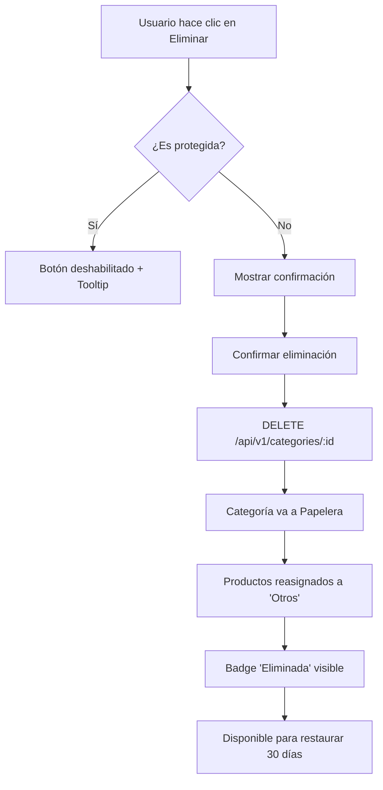
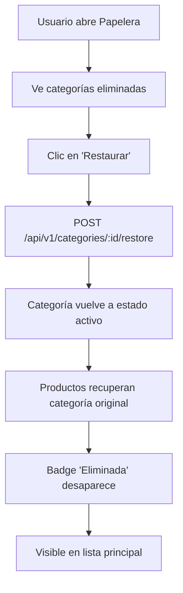
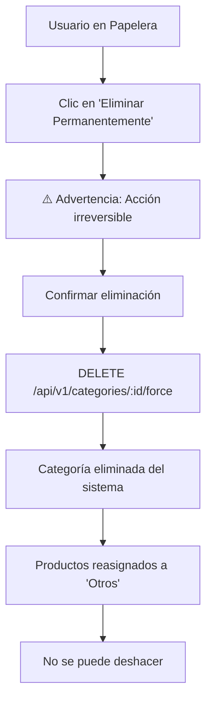

# 🎨 Componentes UI para Categorías - Laravel Integration

## ✅ Componentes Implementados

### 1. **Badges y Indicadores Visuales**

#### Badge de Categoría Protegida
```tsx
{category.is_protected && (
  <Badge variant="secondary" className="gap-1">
    <Shield className="h-3 w-3" />
    Protegida
  </Badge>
)}
```

**Ubicación**: `CategoryRow.tsx` y `CategoryCard.tsx`

**Características**:
- 🛡️ Icono Shield para identificar visualmente
- 📌 Tooltip explicativo al hacer hover
- 🚫 Botón de eliminar deshabilitado automáticamente

---

#### Contador de Productos
```tsx
{category.products_count !== undefined && category.products_count > 0 && (
  <Badge variant="outline" className="gap-1">
    <Package className="h-3 w-3" />
    {category.products_count}
  </Badge>
)}
```

**Ubicación**: `CategoryRow.tsx` y `CategoryCard.tsx`

**Características**:
- 📦 Muestra el número de productos asociados
- 🎯 Solo visible si hay productos (>0)
- 🔄 Se actualiza automáticamente con la respuesta del backend

---

#### Badge de Estado Eliminada
```tsx
{category.deleted_at && (
  <Badge variant="destructive">Eliminada</Badge>
)}
```

**Características**:
- 🗑️ Indica que la categoría está en papelera
- 🔴 Estilo destructive para destacar visualmente
- ⏰ Aparece cuando `deleted_at !== null`

---

#### Badge de Estado Inactiva
```tsx
{!category.is_active && !category.deleted_at && (
  <Badge variant="secondary">Inactiva</Badge>
)}
```

**Características**:
- 💤 Indica categorías desactivadas temporalmente
- ⚫ No confundir con eliminadas (soft delete)
- 🔄 Pueden ser reactivadas sin restaurar

---

### 2. **CategoryRecycleBin Component**

Componente completo para gestión de categorías eliminadas (soft delete).

**Ubicación**: `src/features/categories/components/CategoryRecycleBin.tsx`

#### Características Principales

##### Empty State
```tsx
// Cuando no hay categorías eliminadas
<div className="text-center py-8 text-muted-foreground">
  <Trash2 className="h-12 w-12 mx-auto mb-3 opacity-50" />
  <p>No hay categorías en la papelera</p>
</div>
```

##### Información Detallada de Cada Categoría
- **Nombre** y descripción
- **Contador de productos** asociados
- **Lista de subcategorías** incluidas
- **Fecha de eliminación** (relativa, ej: "hace 2 días")
- **Alertas** sobre reasignación de productos

##### Acciones Disponibles

**Restaurar** (Soft Delete Undo):
```tsx
<Button onClick={() => onRestore(category.id)} variant="default">
  <RotateCcw className="h-4 w-4 mr-2" />
  Restaurar
</Button>
```
- ♻️ Recupera la categoría y todas sus subcategorías
- 🔄 Mantiene todas las asociaciones con productos
- ✅ Vuelve al estado activo

**Eliminar Permanentemente** (Force Delete):
```tsx
<Button onClick={() => onForceDelete(category.id)} variant="destructive">
  <Trash2 className="h-4 w-4 mr-2" />
  Eliminar Permanentemente
</Button>
```
- ⚠️ **Acción irreversible**
- 📦 Reasigna productos a categoría "Otros"
- 🗑️ Elimina completamente del sistema

---

### 3. **useCategoryRecycleBin Hook**

Hook personalizado para la lógica de negocio de la papelera.

**Ubicación**: `src/features/categories/hooks/useCategoryRecycleBin.ts`

#### Datos Expuestos
```typescript
const {
  deletedCategories,      // Categorías en papelera
  deletedCount,          // Contador para badge
  expiringCategories,    // Categorías próximas a expirar (>25 días)
  isLoading,            // Estado de carga

  handleRestore,        // Función para restaurar
  handleForceDelete,    // Función para eliminar permanentemente
  
  getDeletedCategory,   // Obtener por ID
  isInRecycleBin,      // Verificar si está en papelera
} = useCategoryRecycleBin();
```

#### Funcionalidad de Expiración
```typescript
// Categorías que serán eliminadas automáticamente en <5 días
const expiringCategories = useMemo(() => {
  const twentyFiveDaysAgo = new Date();
  twentyFiveDaysAgo.setDate(twentyFiveDaysAgo.getDate() - 25);

  return deletedCategories.filter(cat => {
    const deletedDate = new Date(cat.deleted_at);
    return deletedDate <= twentyFiveDaysAgo;
  });
}, [deletedCategories]);
```

---

## 🎯 Integración en AdminCategories Page

### Toggle de Papelera

```tsx
const [showRecycleBin, setShowRecycleBin] = useState(false);

<Button
  onClick={() => setShowRecycleBin(!showRecycleBin)}
  variant={showRecycleBin ? "default" : "outline"}
>
  <Trash2 className="h-4 w-4 mr-2" />
  Papelera
  {deletedCount > 0 && (
    <Badge variant="destructive" className="ml-2">
      {deletedCount}
    </Badge>
  )}
</Button>
```

**Características**:
- 🔄 Toggle entre vista normal y papelera
- 📊 Badge con contador de elementos eliminados
- 🎨 Cambia estilo cuando está activa

---

### Renderizado Condicional

```tsx
{/* Recycle Bin Section */}
{showRecycleBin && (
  <CategoryRecycleBin
    deletedCategories={deletedCategories}
    onRestore={handleRestore}
    onForceDelete={handleForceDelete}
    isLoading={recycleBinLoading}
  />
)}

{/* Categories Table/Cards */}
{!showRecycleBin && (
  <div className="bg-card rounded-lg shadow-sm border">
    <CategoriesTable ... />
    <CategoriesList ... />
  </div>
)}
```

**Beneficios**:
- 🧹 UI limpia sin tabs innecesarios
- ⚡ Carga solo cuando se necesita
- 📱 Responsive en mobile y desktop

---

## 🎨 Diseño Visual

### Paleta de Colores y Componentes

| Elemento | Componente | Variante | Color |
|----------|-----------|----------|-------|
| Categoría Protegida | `Badge` | `secondary` | Gris |
| Contador Productos | `Badge` | `outline` | Borde |
| Estado Eliminada | `Badge` | `destructive` | Rojo |
| Estado Inactiva | `Badge` | `secondary` | Gris |
| Botón Restaurar | `Button` | `default` | Primario |
| Botón Eliminar Permanente | `Button` | `destructive` | Rojo |

---

### Tooltips Informativos

Todos los elementos interactivos tienen tooltips explicativos:

```tsx
<TooltipProvider>
  <Tooltip>
    <TooltipTrigger asChild>
      <span>
        <Button disabled={category.is_protected} ... />
      </span>
    </TooltipTrigger>
    {category.is_protected && (
      <TooltipContent>
        <p>Las categorías protegidas no pueden eliminarse</p>
      </TooltipContent>
    )}
  </Tooltip>
</TooltipProvider>
```

**Casos de Uso**:
- 🛡️ Explicar por qué un botón está deshabilitado
- ℹ️ Dar contexto sobre badges especiales
- 📚 Ayudar a usuarios nuevos

---

## 📱 Responsive Design

### Desktop (≥768px)
- Badges inline con texto completo
- Tooltips al hacer hover
- Tabla expandible con subcategorías

### Mobile (<768px)
- Badges más compactos
- Iconos prioritarios sobre texto
- Cards apilables con acciones táctiles

### Componentes Adaptables

```tsx
// CategoryRow - Desktop
<div className="flex items-center gap-2">
  <Badge>
    <Shield className="h-3 w-3" />
    Protegida
  </Badge>
</div>

// CategoryCard - Mobile
<Badge className="gap-1 text-xs">
  <Shield className="h-2.5 w-2.5" />
  Protegida
</Badge>
```

---

## 🔄 Flujo de Usuario

### Eliminar Categoría (Soft Delete)



### Restaurar Categoría



### Eliminar Permanentemente (Force Delete)



---

## 🧪 Testing Checklist

### Badges y Estados

- [ ] Badge "Protegida" visible en categoría "Otros"
- [ ] Badge "Protegida" oculta en categorías normales
- [ ] Contador de productos muestra número correcto
- [ ] Contador oculto cuando `products_count === 0`
- [ ] Badge "Eliminada" visible solo con `deleted_at`
- [ ] Badge "Inactiva" visible cuando `is_active === false`

### Papelera de Reciclaje

- [ ] Toggle muestra/oculta papelera correctamente
- [ ] Badge contador actualiza con número de eliminadas
- [ ] Empty state cuando no hay categorías eliminadas
- [ ] Fecha de eliminación formateada correctamente (relativa)
- [ ] Lista de subcategorías se muestra expandida
- [ ] Botón "Restaurar" funcional
- [ ] Botón "Eliminar Permanentemente" requiere confirmación

### Protección de Categorías

- [ ] Botón eliminar deshabilitado en categorías protegidas
- [ ] Tooltip explicativo visible al hover
- [ ] Categoría "Otros" siempre protegida
- [ ] No se puede eliminar ni soft delete ni force delete

### Responsive

- [ ] Badges legibles en mobile (<375px)
- [ ] Tooltips funcionan en desktop
- [ ] Cards táctiles funcionan bien en tablet
- [ ] Papelera scrolleable en mobile

---

## 🚀 Próximas Mejoras (Futuro)

### Auto-Eliminación (Laravel Scheduler)

```php
// Backend Laravel - Task Scheduler
protected function schedule(Schedule $schedule)
{
    // Auto-delete categories after 30 days
    $schedule->call(function () {
        Category::onlyTrashed()
            ->where('deleted_at', '<=', now()->subDays(30))
            ->forceDelete();
    })->daily();
}
```

### Notificaciones de Expiración

```tsx
// Mostrar advertencia cuando quedan <5 días
{expiringCategories.length > 0 && (
  <Alert variant="warning">
    <AlertTriangle className="h-4 w-4" />
    <AlertDescription>
      {expiringCategories.length} categoría(s) serán eliminadas 
      permanentemente en menos de 5 días
    </AlertDescription>
  </Alert>
)}
```

### Bulk Actions

```tsx
// Restaurar o eliminar múltiples categorías
<Button onClick={handleBulkRestore}>
  Restaurar Seleccionadas ({selectedCount})
</Button>
```

### Historial de Cambios

```tsx
// Ver quién eliminó y cuándo
<div className="text-xs text-muted-foreground">
  Eliminada por {category.deleted_by.name}
</div>
```

---

## 📚 Archivos Modificados/Creados

### Nuevos Archivos
```
src/features/categories/
├── components/
│   └── CategoryRecycleBin.tsx          🆕 Componente de papelera
├── hooks/
│   └── useCategoryRecycleBin.ts        🆕 Hook de lógica papelera
└── utils/
    └── migration.ts                    (ya existía, actualizado)
```

### Archivos Modificados
```
src/features/categories/
├── components/
│   ├── CategoryRow.tsx                 ✅ Badges + tooltips + protección
│   ├── CategoryCard.tsx                ✅ Badges + tooltips + protección
│   └── index.ts                        ✅ Export CategoryRecycleBin
├── hooks/
│   └── index.ts                        ✅ Export useCategoryRecycleBin
└── types/
    └── category.types.ts               (ya actualizado en fase anterior)
```

### Páginas Actualizadas
```
src/pages/
└── AdminCategories.tsx                 ✅ Toggle papelera + integración hooks
```

---

## 🎓 Ejemplos de Uso

### Verificar si categoría es protegida

```typescript
import { useCategories } from '@/features/categories';

const { categories } = useCategories();
const otrosCategory = categories.find(c => c.slug === 'otros');

console.log(otrosCategory?.is_protected); // true
```

### Obtener categorías eliminadas

```typescript
import { useCategoryRecycleBin } from '@/features/categories';

const { deletedCategories, deletedCount } = useCategoryRecycleBin();

console.log(`Hay ${deletedCount} categorías en papelera`);
```

### Restaurar categoría programáticamente

```typescript
const { handleRestore } = useCategoryRecycleBin();

// En un botón o acción
await handleRestore(categoryId);
```

---

## ⚠️ Notas Importantes

### Categorías Protegidas

1. **"Otros" es siempre protegida** (`is_protected: true`)
2. **No se puede eliminar** ni con soft delete ni force delete
3. **Backend valida** antes de permitir eliminación
4. **Frontend deshabilita botones** para mejor UX

### Soft Delete vs Force Delete

| Acción | Endpoint | Reversible | Productos |
|--------|----------|-----------|-----------|
| Soft Delete | `DELETE /categories/:id` | ✅ Sí | Reasignados temporalmente |
| Force Delete | `DELETE /categories/:id/force` | ❌ No | Reasignados permanentemente |
| Restore | `POST /categories/:id/restore` | N/A | Recuperan categoría original |

### Reasignación de Productos

Cuando se elimina una categoría (soft o permanente):
1. Backend busca categoría "Otros"
2. Reasigna todos los productos automáticamente
3. Responde con número de productos reasignados
4. Frontend muestra notificación con el conteo

---

**Documentación actualizada**: 2024  
**Versión**: 1.0  
**Estado**: ✅ Implementado y funcional  
**Pendiente**: Integración con API Laravel real
