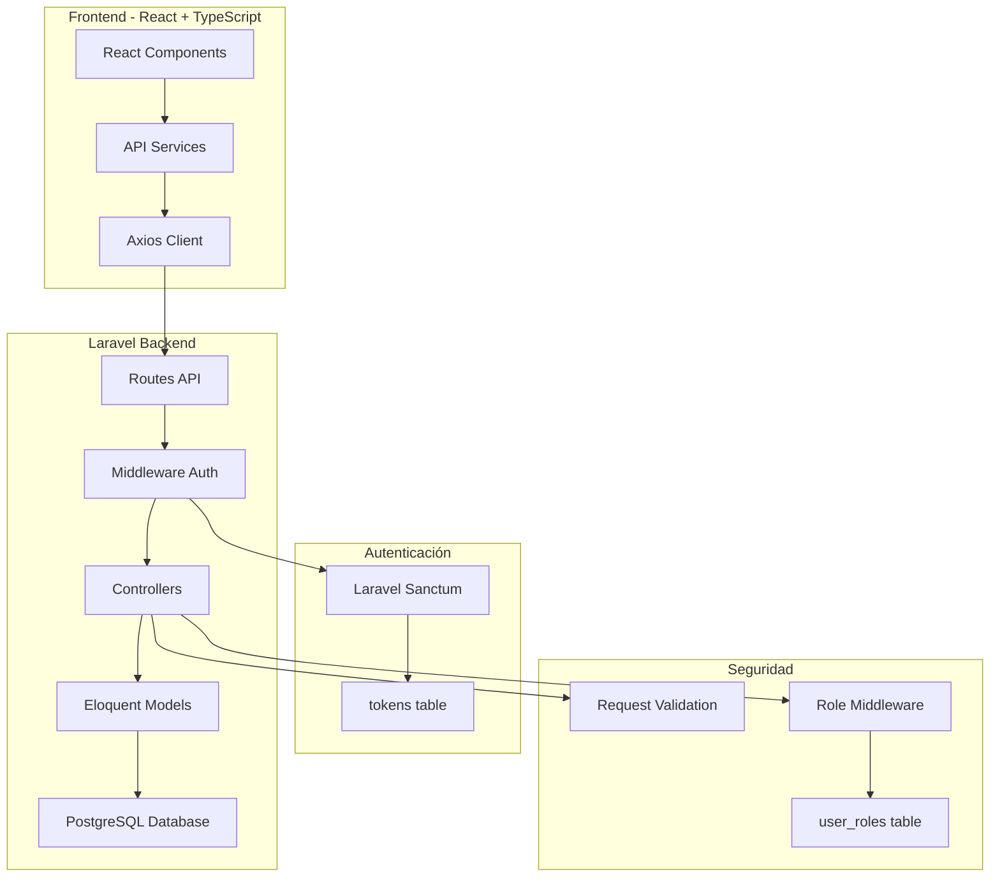
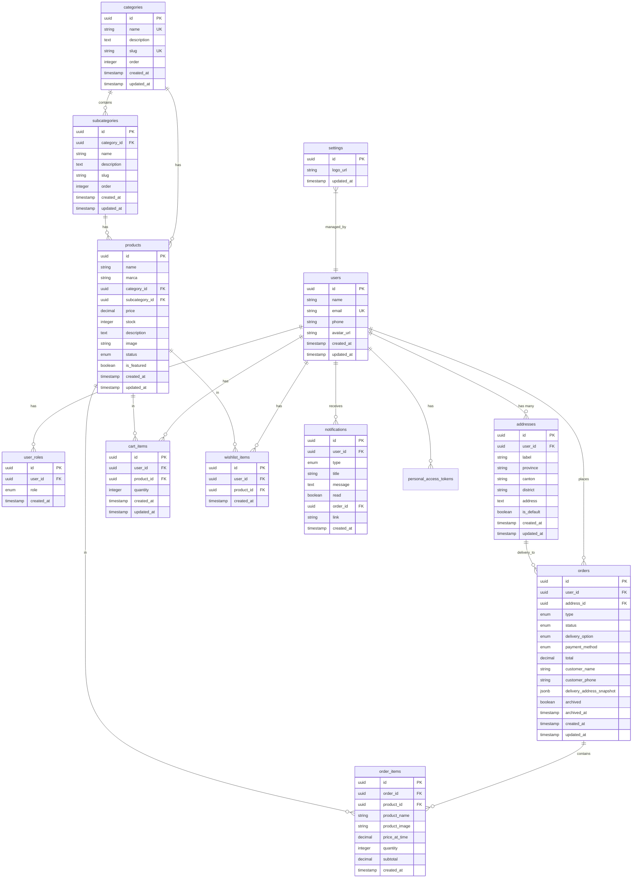
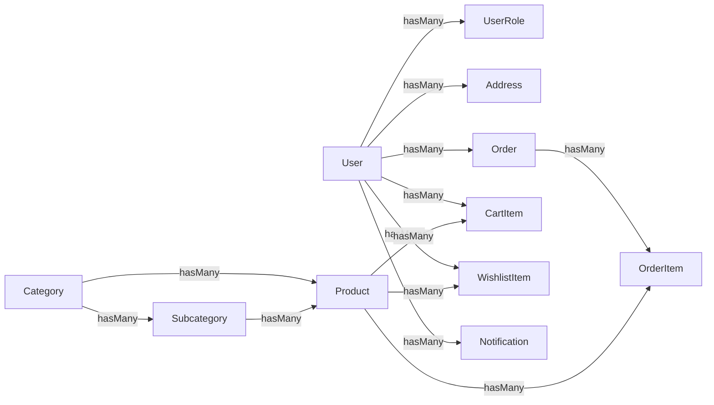

# Esquema de Base de Datos - Laravel + PostgreSQL

## 📋 Índice

1. [Visión General](#visión-general)
2. [Arquitectura Laravel + PostgreSQL](#arquitectura-laravel--postgresql)
3. [Diagrama Entidad-Relación](#diagrama-entidad-relación)
4. [Enums y Tipos PostgreSQL](#enums-y-tipos-postgresql)
5. [Tablas de Base de Datos](#tablas-de-base-de-datos)
6. [Índices y Optimizaciones](#índices-y-optimizaciones)
7. [Migraciones Laravel](#migraciones-laravel)
8. [Modelos Eloquent](#modelos-eloquent)
9. [Relaciones Eloquent](#relaciones-eloquent)
10. [Middleware y Autenticación](#middleware-y-autenticación)
11. [Controladores API](#controladores-api)
12. [Validaciones Laravel](#validaciones-laravel)
13. [Mapeo TypeScript ↔ Laravel](#mapeo-typescript--laravel)
14. [Estrategia de Migración](#estrategia-de-migración)
15. [Checklist de Implementación](#checklist-de-implementación)

---

## 1. Visión General

### Descripción del Sistema
E-commerce para Costa Rica con gestión completa de productos, pedidos, usuarios y notificaciones.

### Stack Tecnológico
- **Backend**: Laravel 11+ con Sanctum para autenticación API
- **Base de Datos**: PostgreSQL 15+
- **Frontend**: React + TypeScript + Vite
- **API**: RESTful JSON API
- **Autenticación**: Laravel Sanctum (Token-based)

### Principios de Diseño
- ✅ **Seguridad**: Roles en tabla separada (`user_roles`)
- ✅ **Normalización**: 3NF para evitar redundancia
- ✅ **Performance**: Índices en queries críticos
- ✅ **Escalabilidad**: Preparado para millones de registros
- ✅ **Trazabilidad**: Timestamps automáticos en todas las tablas

---

## 2. Arquitectura Laravel + PostgreSQL



### Flujo de Autenticación

1. **Login**: `POST /api/auth/login`
   - Laravel valida credenciales con `Auth::attempt()`
   - Genera token Sanctum: `$user->createToken('auth-token')`
   - Retorna token + datos de usuario

2. **Request Autenticado**: 
   - Frontend envía header: `Authorization: Bearer {token}`
   - Middleware `auth:sanctum` valida token
   - Laravel obtiene usuario: `$request->user()`

3. **Verificación de Rol**:
   - Middleware `role:admin` consulta `user_roles` table
   - Método `hasRole()` en modelo User

---

## 3. Diagrama Entidad-Relación



---

## 4. Enums y Tipos PostgreSQL

### SQL para crear Enums

```sql
-- Roles de usuario
CREATE TYPE app_role AS ENUM ('admin', 'cliente');

-- Estados de orden
CREATE TYPE order_status AS ENUM ('pending', 'completed', 'cancelled');

-- Tipos de orden
CREATE TYPE order_type AS ENUM ('online', 'in-store');

-- Opciones de entrega
CREATE TYPE delivery_option AS ENUM ('pickup', 'delivery');

-- Estados de producto
CREATE TYPE product_status AS ENUM ('active', 'inactive');

-- Tipos de notificación
CREATE TYPE notification_type AS ENUM ('order', 'user', 'product', 'general');

-- Métodos de pago
CREATE TYPE payment_method AS ENUM ('cash', 'card', 'transfer', 'sinpe');
```

### Migración Laravel para Enums

```php
// database/migrations/2024_01_01_000001_create_enums.php
<?php

use Illuminate\Database\Migrations\Migration;
use Illuminate\Support\Facades\DB;

return new class extends Migration
{
    public function up()
    {
        DB::statement("CREATE TYPE app_role AS ENUM ('admin', 'cliente')");
        DB::statement("CREATE TYPE order_status AS ENUM ('pending', 'completed', 'cancelled')");
        DB::statement("CREATE TYPE order_type AS ENUM ('online', 'in-store')");
        DB::statement("CREATE TYPE delivery_option AS ENUM ('pickup', 'delivery')");
        DB::statement("CREATE TYPE product_status AS ENUM ('active', 'inactive')");
        DB::statement("CREATE TYPE notification_type AS ENUM ('order', 'user', 'product', 'general')");
        DB::statement("CREATE TYPE payment_method AS ENUM ('cash', 'card', 'transfer', 'sinpe')");
    }

    public function down()
    {
        DB::statement("DROP TYPE IF EXISTS payment_method");
        DB::statement("DROP TYPE IF EXISTS notification_type");
        DB::statement("DROP TYPE IF EXISTS product_status");
        DB::statement("DROP TYPE IF EXISTS delivery_option");
        DB::statement("DROP TYPE IF EXISTS order_type");
        DB::statement("DROP TYPE IF EXISTS order_status");
        DB::statement("DROP TYPE IF EXISTS app_role");
    }
};
```

---

## 5. Tablas de Base de Datos

### 5.1 Tabla: `users`

**Descripción**: Perfiles de usuarios (clientes y administradores)

**Características**:
- ✅ UUID como Primary Key
- ✅ Email único
- ✅ Timestamps automáticos
- ✅ Avatar opcional (Lovable Uploads)

**Columnas**:

| Columna | Tipo | Constraints | Descripción |
|---------|------|-------------|-------------|
| `id` | UUID | PRIMARY KEY | Identificador único |
| `name` | VARCHAR(100) | NOT NULL | Nombre completo |
| `email` | VARCHAR(255) | UNIQUE, NOT NULL | Email único |
| `email_verified_at` | TIMESTAMP | NULL | Fecha de verificación |
| `password` | VARCHAR(255) | NOT NULL | Hash bcrypt |
| `phone` | VARCHAR(20) | NULL | Teléfono contacto |
| `avatar_url` | TEXT | NULL | URL de avatar |
| `remember_token` | VARCHAR(100) | NULL | Token de sesión |
| `created_at` | TIMESTAMP | DEFAULT NOW() | Fecha de creación |
| `updated_at` | TIMESTAMP | DEFAULT NOW() | Fecha de actualización |

**SQL**:

```sql
CREATE TABLE users (
    id UUID PRIMARY KEY DEFAULT gen_random_uuid(),
    name VARCHAR(100) NOT NULL,
    email VARCHAR(255) UNIQUE NOT NULL,
    email_verified_at TIMESTAMP NULL,
    password VARCHAR(255) NOT NULL,
    phone VARCHAR(20) NULL,
    avatar_url TEXT NULL,
    remember_token VARCHAR(100) NULL,
    created_at TIMESTAMP DEFAULT NOW(),
    updated_at TIMESTAMP DEFAULT NOW(),
    
    CONSTRAINT valid_email CHECK (email ~* '^[A-Za-z0-9._%+-]+@[A-Za-z0-9.-]+\.[A-Z|a-z]{2,}$')
);

COMMENT ON TABLE users IS 'Perfiles de usuarios del sistema';
COMMENT ON COLUMN users.email IS 'Email único del usuario';
COMMENT ON COLUMN users.phone IS 'Teléfono de contacto (formato: +506 8888-8888)';
```

**Migración Laravel**:

```php
// database/migrations/2024_01_01_000002_create_users_table.php
Schema::create('users', function (Blueprint $table) {
    $table->uuid('id')->primary()->default(DB::raw('gen_random_uuid()'));
    $table->string('name', 100);
    $table->string('email', 255)->unique();
    $table->timestamp('email_verified_at')->nullable();
    $table->string('password');
    $table->string('phone', 20)->nullable();
    $table->text('avatar_url')->nullable();
    $table->rememberToken();
    $table->timestamps();
});
```

**Mapeo TypeScript**: `UserProfile` (src/types/user.types.ts)

---

### 5.2 Tabla: `user_roles`

**Descripción**: Roles de usuarios (seguridad crítica)

**⚠️ CRÍTICO PARA SEGURIDAD**:
- NUNCA almacenar roles en tabla `users`
- Tabla separada previene escalada de privilegios
- Un usuario puede tener múltiples roles

**Columnas**:

| Columna | Tipo | Constraints | Descripción |
|---------|------|-------------|-------------|
| `id` | UUID | PRIMARY KEY | Identificador único |
| `user_id` | UUID | FOREIGN KEY, NOT NULL | Referencia a users |
| `role` | app_role | NOT NULL | Rol del usuario |
| `created_at` | TIMESTAMP | DEFAULT NOW() | Fecha de asignación |

**SQL**:

```sql
CREATE TABLE user_roles (
    id UUID PRIMARY KEY DEFAULT gen_random_uuid(),
    user_id UUID NOT NULL REFERENCES users(id) ON DELETE CASCADE,
    role app_role NOT NULL,
    created_at TIMESTAMP DEFAULT NOW(),
    
    UNIQUE(user_id, role) -- Un usuario no puede tener el mismo rol duplicado
);

CREATE INDEX idx_user_roles_user_id ON user_roles(user_id);
CREATE INDEX idx_user_roles_role ON user_roles(role);

COMMENT ON TABLE user_roles IS '⚠️ CRÍTICO: Roles de usuarios (separado por seguridad)';
```

**Migración Laravel**:

```php
// database/migrations/2024_01_01_000003_create_user_roles_table.php
Schema::create('user_roles', function (Blueprint $table) {
    $table->uuid('id')->primary()->default(DB::raw('gen_random_uuid()'));
    $table->foreignUuid('user_id')->constrained()->onDelete('cascade');
    $table->enum('role', ['admin', 'cliente'])->default('cliente');
    $table->timestamp('created_at')->useCurrent();
    
    $table->unique(['user_id', 'role']);
});
```

---

### 5.3 Tabla: `addresses`

**Descripción**: Direcciones de entrega de clientes

**Columnas**:

| Columna | Tipo | Constraints | Descripción |
|---------|------|-------------|-------------|
| `id` | UUID | PRIMARY KEY | Identificador único |
| `user_id` | UUID | FOREIGN KEY, NOT NULL | Propietario |
| `label` | VARCHAR(50) | NOT NULL | Etiqueta (Casa, Trabajo) |
| `province` | VARCHAR(100) | NOT NULL | Provincia de Costa Rica |
| `canton` | VARCHAR(100) | NOT NULL | Cantón |
| `district` | VARCHAR(100) | NOT NULL | Distrito |
| `address` | TEXT | NOT NULL | Dirección completa |
| `is_default` | BOOLEAN | DEFAULT FALSE | Dirección por defecto |
| `created_at` | TIMESTAMP | DEFAULT NOW() | Fecha de creación |
| `updated_at` | TIMESTAMP | DEFAULT NOW() | Fecha de actualización |

**SQL**:

```sql
CREATE TABLE addresses (
    id UUID PRIMARY KEY DEFAULT gen_random_uuid(),
    user_id UUID NOT NULL REFERENCES users(id) ON DELETE CASCADE,
    label VARCHAR(50) NOT NULL,
    province VARCHAR(100) NOT NULL,
    canton VARCHAR(100) NOT NULL,
    district VARCHAR(100) NOT NULL,
    address TEXT NOT NULL,
    is_default BOOLEAN DEFAULT FALSE,
    created_at TIMESTAMP DEFAULT NOW(),
    updated_at TIMESTAMP DEFAULT NOW(),
    
    CONSTRAINT address_length CHECK (LENGTH(address) >= 10)
);

CREATE INDEX idx_addresses_user_id ON addresses(user_id);
CREATE INDEX idx_addresses_is_default ON addresses(user_id, is_default);
```

**Migración Laravel**:

```php
Schema::create('addresses', function (Blueprint $table) {
    $table->uuid('id')->primary()->default(DB::raw('gen_random_uuid()'));
    $table->foreignUuid('user_id')->constrained()->onDelete('cascade');
    $table->string('label', 50);
    $table->string('province', 100);
    $table->string('canton', 100);
    $table->string('district', 100);
    $table->text('address');
    $table->boolean('is_default')->default(false);
    $table->timestamps();
});
```

**Mapeo TypeScript**: `Address` (src/types/user.types.ts)

---

### 5.4 Tabla: `categories`

**Descripción**: Categorías principales de productos

**Columnas**:

| Columna | Tipo | Constraints | Descripción |
|---------|------|-------------|-------------|
| `id` | UUID | PRIMARY KEY | Identificador único |
| `name` | VARCHAR(100) | UNIQUE, NOT NULL | Nombre de categoría |
| `description` | TEXT | NULL | Descripción opcional |
| `slug` | VARCHAR(100) | UNIQUE, NOT NULL | URL-friendly slug |
| `order` | INTEGER | DEFAULT 0 | Orden de visualización |
| `created_at` | TIMESTAMP | DEFAULT NOW() | Fecha de creación |
| `updated_at` | TIMESTAMP | DEFAULT NOW() | Fecha de actualización |

**SQL**:

```sql
CREATE TABLE categories (
    id UUID PRIMARY KEY DEFAULT gen_random_uuid(),
    name VARCHAR(100) UNIQUE NOT NULL,
    description TEXT NULL,
    slug VARCHAR(100) UNIQUE NOT NULL,
    "order" INTEGER DEFAULT 0,
    created_at TIMESTAMP DEFAULT NOW(),
    updated_at TIMESTAMP DEFAULT NOW()
);

CREATE INDEX idx_categories_order ON categories("order");
```

**Migración Laravel**:

```php
Schema::create('categories', function (Blueprint $table) {
    $table->uuid('id')->primary()->default(DB::raw('gen_random_uuid()'));
    $table->string('name', 100)->unique();
    $table->text('description')->nullable();
    $table->string('slug', 100)->unique();
    $table->integer('order')->default(0);
    $table->timestamps();
});
```

**Mapeo TypeScript**: `Category` (src/types/product.types.ts)

---

### 5.5 Tabla: `subcategories`

**Descripción**: Subcategorías dentro de categorías

**Columnas**:

| Columna | Tipo | Constraints | Descripción |
|---------|------|-------------|-------------|
| `id` | UUID | PRIMARY KEY | Identificador único |
| `category_id` | UUID | FOREIGN KEY, NOT NULL | Categoría padre |
| `name` | VARCHAR(100) | NOT NULL | Nombre de subcategoría |
| `description` | TEXT | NULL | Descripción opcional |
| `slug` | VARCHAR(100) | NOT NULL | URL-friendly slug |
| `order` | INTEGER | DEFAULT 0 | Orden de visualización |
| `created_at` | TIMESTAMP | DEFAULT NOW() | Fecha de creación |
| `updated_at` | TIMESTAMP | DEFAULT NOW() | Fecha de actualización |

**SQL**:

```sql
CREATE TABLE subcategories (
    id UUID PRIMARY KEY DEFAULT gen_random_uuid(),
    category_id UUID NOT NULL REFERENCES categories(id) ON DELETE CASCADE,
    name VARCHAR(100) NOT NULL,
    description TEXT NULL,
    slug VARCHAR(100) NOT NULL,
    "order" INTEGER DEFAULT 0,
    created_at TIMESTAMP DEFAULT NOW(),
    updated_at TIMESTAMP DEFAULT NOW(),
    
    UNIQUE(category_id, slug)
);

CREATE INDEX idx_subcategories_category_id ON subcategories(category_id);
```

**Migración Laravel**:

```php
Schema::create('subcategories', function (Blueprint $table) {
    $table->uuid('id')->primary()->default(DB::raw('gen_random_uuid()'));
    $table->foreignUuid('category_id')->constrained()->onDelete('cascade');
    $table->string('name', 100);
    $table->text('description')->nullable();
    $table->string('slug', 100);
    $table->integer('order')->default(0);
    $table->timestamps();
    
    $table->unique(['category_id', 'slug']);
});
```

**Mapeo TypeScript**: `Subcategory` (src/types/product.types.ts)

---

### 5.6 Tabla: `products`

**Descripción**: Catálogo de productos

**Columnas**:

| Columna | Tipo | Constraints | Descripción |
|---------|------|-------------|-------------|
| `id` | UUID | PRIMARY KEY | Identificador único |
| `name` | VARCHAR(255) | NOT NULL | Nombre del producto |
| `marca` | VARCHAR(100) | NULL | Marca del producto |
| `category_id` | UUID | FOREIGN KEY, NOT NULL | Categoría |
| `subcategory_id` | UUID | FOREIGN KEY, NULL | Subcategoría opcional |
| `price` | DECIMAL(10,2) | NOT NULL | Precio en colones |
| `stock` | INTEGER | DEFAULT 0 | Stock disponible |
| `description` | TEXT | NULL | Descripción del producto |
| `image` | TEXT | NOT NULL | URL de imagen |
| `status` | product_status | DEFAULT 'active' | Estado del producto |
| `is_featured` | BOOLEAN | DEFAULT FALSE | Producto destacado |
| `created_at` | TIMESTAMP | DEFAULT NOW() | Fecha de creación |
| `updated_at` | TIMESTAMP | DEFAULT NOW() | Fecha de actualización |

**SQL**:

```sql
CREATE TABLE products (
    id UUID PRIMARY KEY DEFAULT gen_random_uuid(),
    name VARCHAR(255) NOT NULL,
    marca VARCHAR(100) NULL,
    category_id UUID NOT NULL REFERENCES categories(id) ON DELETE RESTRICT,
    subcategory_id UUID NULL REFERENCES subcategories(id) ON DELETE SET NULL,
    price DECIMAL(10,2) NOT NULL CHECK (price >= 0),
    stock INTEGER DEFAULT 0 CHECK (stock >= 0),
    description TEXT NULL,
    image TEXT NOT NULL,
    status product_status DEFAULT 'active',
    is_featured BOOLEAN DEFAULT FALSE,
    created_at TIMESTAMP DEFAULT NOW(),
    updated_at TIMESTAMP DEFAULT NOW()
);

-- Índices críticos para performance
CREATE INDEX idx_products_category_id ON products(category_id);
CREATE INDEX idx_products_subcategory_id ON products(subcategory_id);
CREATE INDEX idx_products_status ON products(status);
CREATE INDEX idx_products_is_featured ON products(is_featured) WHERE is_featured = TRUE;
CREATE INDEX idx_products_name_trgm ON products USING gin(name gin_trgm_ops);
```

**Migración Laravel**:

```php
Schema::create('products', function (Blueprint $table) {
    $table->uuid('id')->primary()->default(DB::raw('gen_random_uuid()'));
    $table->string('name', 255);
    $table->string('marca', 100)->nullable();
    $table->foreignUuid('category_id')->constrained()->onDelete('restrict');
    $table->foreignUuid('subcategory_id')->nullable()->constrained()->onDelete('set null');
    $table->decimal('price', 10, 2);
    $table->integer('stock')->default(0);
    $table->text('description')->nullable();
    $table->text('image');
    $table->enum('status', ['active', 'inactive'])->default('active');
    $table->boolean('is_featured')->default(false);
    $table->timestamps();
});
```

**Mapeo TypeScript**: `Product` (src/types/product.types.ts)

---

### 5.7 Tabla: `orders`

**Descripción**: Pedidos de clientes (online e in-store)

**Columnas**:

| Columna | Tipo | Constraints | Descripción |
|---------|------|-------------|-------------|
| `id` | UUID | PRIMARY KEY | Identificador único |
| `user_id` | UUID | FOREIGN KEY, NULL | Usuario (NULL para in-store) |
| `address_id` | UUID | FOREIGN KEY, NULL | Dirección de entrega |
| `type` | order_type | NOT NULL | online o in-store |
| `status` | order_status | DEFAULT 'pending' | Estado del pedido |
| `delivery_option` | delivery_option | NULL | pickup o delivery |
| `payment_method` | payment_method | NULL | Método de pago |
| `total` | DECIMAL(10,2) | NOT NULL | Total del pedido |
| `customer_name` | VARCHAR(100) | NOT NULL | Nombre del cliente |
| `customer_phone` | VARCHAR(20) | NOT NULL | Teléfono del cliente |
| `delivery_address_snapshot` | JSONB | NULL | Snapshot de dirección |
| `archived` | BOOLEAN | DEFAULT FALSE | Pedido archivado |
| `archived_at` | TIMESTAMP | NULL | Fecha de archivo |
| `created_at` | TIMESTAMP | DEFAULT NOW() | Fecha de creación |
| `updated_at` | TIMESTAMP | DEFAULT NOW() | Fecha de actualización |

**SQL**:

```sql
CREATE TABLE orders (
    id UUID PRIMARY KEY DEFAULT gen_random_uuid(),
    user_id UUID NULL REFERENCES users(id) ON DELETE SET NULL,
    address_id UUID NULL REFERENCES addresses(id) ON DELETE SET NULL,
    type order_type NOT NULL,
    status order_status DEFAULT 'pending',
    delivery_option delivery_option NULL,
    payment_method payment_method NULL,
    total DECIMAL(10,2) NOT NULL CHECK (total >= 0),
    customer_name VARCHAR(100) NOT NULL,
    customer_phone VARCHAR(20) NOT NULL,
    delivery_address_snapshot JSONB NULL,
    archived BOOLEAN DEFAULT FALSE,
    archived_at TIMESTAMP NULL,
    created_at TIMESTAMP DEFAULT NOW(),
    updated_at TIMESTAMP DEFAULT NOW()
);

-- Índices para queries frecuentes
CREATE INDEX idx_orders_user_id ON orders(user_id);
CREATE INDEX idx_orders_status ON orders(status);
CREATE INDEX idx_orders_type ON orders(type);
CREATE INDEX idx_orders_created_at ON orders(created_at DESC);
CREATE INDEX idx_orders_archived ON orders(archived) WHERE archived = FALSE;
CREATE INDEX idx_orders_user_status ON orders(user_id, status);
```

**Migración Laravel**:

```php
Schema::create('orders', function (Blueprint $table) {
    $table->uuid('id')->primary()->default(DB::raw('gen_random_uuid()'));
    $table->foreignUuid('user_id')->nullable()->constrained()->onDelete('set null');
    $table->foreignUuid('address_id')->nullable()->constrained()->onDelete('set null');
    $table->enum('type', ['online', 'in-store']);
    $table->enum('status', ['pending', 'completed', 'cancelled'])->default('pending');
    $table->enum('delivery_option', ['pickup', 'delivery'])->nullable();
    $table->enum('payment_method', ['cash', 'card', 'transfer', 'sinpe'])->nullable();
    $table->decimal('total', 10, 2);
    $table->string('customer_name', 100);
    $table->string('customer_phone', 20);
    $table->jsonb('delivery_address_snapshot')->nullable();
    $table->boolean('archived')->default(false);
    $table->timestamp('archived_at')->nullable();
    $table->timestamps();
});
```

**Mapeo TypeScript**: `Order` (src/types/order.types.ts)

---

### 5.8 Tabla: `order_items`

**Descripción**: Items individuales de cada pedido

**Columnas**:

| Columna | Tipo | Constraints | Descripción |
|---------|------|-------------|-------------|
| `id` | UUID | PRIMARY KEY | Identificador único |
| `order_id` | UUID | FOREIGN KEY, NOT NULL | Pedido padre |
| `product_id` | UUID | FOREIGN KEY, NOT NULL | Producto |
| `product_name` | VARCHAR(255) | NOT NULL | Snapshot del nombre |
| `product_image` | TEXT | NOT NULL | Snapshot de la imagen |
| `price_at_time` | DECIMAL(10,2) | NOT NULL | Precio al momento |
| `quantity` | INTEGER | NOT NULL | Cantidad pedida |
| `subtotal` | DECIMAL(10,2) | NOT NULL | Subtotal calculado |
| `created_at` | TIMESTAMP | DEFAULT NOW() | Fecha de creación |

**SQL**:

```sql
CREATE TABLE order_items (
    id UUID PRIMARY KEY DEFAULT gen_random_uuid(),
    order_id UUID NOT NULL REFERENCES orders(id) ON DELETE CASCADE,
    product_id UUID NOT NULL REFERENCES products(id) ON DELETE RESTRICT,
    product_name VARCHAR(255) NOT NULL,
    product_image TEXT NOT NULL,
    price_at_time DECIMAL(10,2) NOT NULL CHECK (price_at_time >= 0),
    quantity INTEGER NOT NULL CHECK (quantity > 0),
    subtotal DECIMAL(10,2) NOT NULL CHECK (subtotal >= 0),
    created_at TIMESTAMP DEFAULT NOW()
);

CREATE INDEX idx_order_items_order_id ON order_items(order_id);
CREATE INDEX idx_order_items_product_id ON order_items(product_id);
```

**Migración Laravel**:

```php
Schema::create('order_items', function (Blueprint $table) {
    $table->uuid('id')->primary()->default(DB::raw('gen_random_uuid()'));
    $table->foreignUuid('order_id')->constrained()->onDelete('cascade');
    $table->foreignUuid('product_id')->constrained()->onDelete('restrict');
    $table->string('product_name', 255);
    $table->text('product_image');
    $table->decimal('price_at_time', 10, 2);
    $table->integer('quantity');
    $table->decimal('subtotal', 10, 2);
    $table->timestamp('created_at')->useCurrent();
});
```

**Mapeo TypeScript**: `OrderItem` (src/types/order.types.ts)

---

### 5.9 Tabla: `cart_items`

**Descripción**: Carrito de compras de usuarios

**Columnas**:

| Columna | Tipo | Constraints | Descripción |
|---------|------|-------------|-------------|
| `id` | UUID | PRIMARY KEY | Identificador único |
| `user_id` | UUID | FOREIGN KEY, NOT NULL | Propietario |
| `product_id` | UUID | FOREIGN KEY, NOT NULL | Producto |
| `quantity` | INTEGER | NOT NULL | Cantidad |
| `created_at` | TIMESTAMP | DEFAULT NOW() | Fecha de creación |
| `updated_at` | TIMESTAMP | DEFAULT NOW() | Fecha de actualización |

**SQL**:

```sql
CREATE TABLE cart_items (
    id UUID PRIMARY KEY DEFAULT gen_random_uuid(),
    user_id UUID NOT NULL REFERENCES users(id) ON DELETE CASCADE,
    product_id UUID NOT NULL REFERENCES products(id) ON DELETE CASCADE,
    quantity INTEGER NOT NULL CHECK (quantity > 0),
    created_at TIMESTAMP DEFAULT NOW(),
    updated_at TIMESTAMP DEFAULT NOW(),
    
    UNIQUE(user_id, product_id) -- Un producto solo puede estar una vez en el carrito
);

CREATE INDEX idx_cart_items_user_id ON cart_items(user_id);
```

**Migración Laravel**:

```php
Schema::create('cart_items', function (Blueprint $table) {
    $table->uuid('id')->primary()->default(DB::raw('gen_random_uuid()'));
    $table->foreignUuid('user_id')->constrained()->onDelete('cascade');
    $table->foreignUuid('product_id')->constrained()->onDelete('cascade');
    $table->integer('quantity');
    $table->timestamps();
    
    $table->unique(['user_id', 'product_id']);
});
```

**Mapeo TypeScript**: `CartItem` (src/types/cart.types.ts)

---

### 5.10 Tabla: `wishlist_items`

**Descripción**: Productos favoritos de usuarios

**Columnas**:

| Columna | Tipo | Constraints | Descripción |
|---------|------|-------------|-------------|
| `id` | UUID | PRIMARY KEY | Identificador único |
| `user_id` | UUID | FOREIGN KEY, NOT NULL | Propietario |
| `product_id` | UUID | FOREIGN KEY, NOT NULL | Producto |
| `created_at` | TIMESTAMP | DEFAULT NOW() | Fecha de creación |

**SQL**:

```sql
CREATE TABLE wishlist_items (
    id UUID PRIMARY KEY DEFAULT gen_random_uuid(),
    user_id UUID NOT NULL REFERENCES users(id) ON DELETE CASCADE,
    product_id UUID NOT NULL REFERENCES products(id) ON DELETE CASCADE,
    created_at TIMESTAMP DEFAULT NOW(),
    
    UNIQUE(user_id, product_id)
);

CREATE INDEX idx_wishlist_items_user_id ON wishlist_items(user_id);
```

**Migración Laravel**:

```php
Schema::create('wishlist_items', function (Blueprint $table) {
    $table->uuid('id')->primary()->default(DB::raw('gen_random_uuid()'));
    $table->foreignUuid('user_id')->constrained()->onDelete('cascade');
    $table->foreignUuid('product_id')->constrained()->onDelete('cascade');
    $table->timestamp('created_at')->useCurrent();
    
    $table->unique(['user_id', 'product_id']);
});
```

---

### 5.11 Tabla: `notifications`

**Descripción**: Notificaciones para usuarios

**Columnas**:

| Columna | Tipo | Constraints | Descripción |
|---------|------|-------------|-------------|
| `id` | UUID | PRIMARY KEY | Identificador único |
| `user_id` | UUID | FOREIGN KEY, NOT NULL | Destinatario |
| `type` | notification_type | NOT NULL | Tipo de notificación |
| `title` | VARCHAR(255) | NOT NULL | Título |
| `message` | TEXT | NOT NULL | Mensaje |
| `read` | BOOLEAN | DEFAULT FALSE | Leída o no |
| `order_id` | UUID | FOREIGN KEY, NULL | Pedido relacionado |
| `link` | VARCHAR(500) | NULL | URL de redirección |
| `created_at` | TIMESTAMP | DEFAULT NOW() | Fecha de creación |

**SQL**:

```sql
CREATE TABLE notifications (
    id UUID PRIMARY KEY DEFAULT gen_random_uuid(),
    user_id UUID NOT NULL REFERENCES users(id) ON DELETE CASCADE,
    type notification_type NOT NULL,
    title VARCHAR(255) NOT NULL,
    message TEXT NOT NULL,
    read BOOLEAN DEFAULT FALSE,
    order_id UUID NULL REFERENCES orders(id) ON DELETE SET NULL,
    link VARCHAR(500) NULL,
    created_at TIMESTAMP DEFAULT NOW()
);

CREATE INDEX idx_notifications_user_id ON notifications(user_id);
CREATE INDEX idx_notifications_read ON notifications(user_id, read);
CREATE INDEX idx_notifications_created_at ON notifications(created_at DESC);
```

**Migración Laravel**:

```php
Schema::create('notifications', function (Blueprint $table) {
    $table->uuid('id')->primary()->default(DB::raw('gen_random_uuid()'));
    $table->foreignUuid('user_id')->constrained()->onDelete('cascade');
    $table->enum('type', ['order', 'user', 'product', 'general']);
    $table->string('title', 255);
    $table->text('message');
    $table->boolean('read')->default(false);
    $table->foreignUuid('order_id')->nullable()->constrained()->onDelete('set null');
    $table->string('link', 500)->nullable();
    $table->timestamp('created_at')->useCurrent();
});
```

**Mapeo TypeScript**: `Notification` (src/types/notification.types.ts)

---

### 5.12 Tabla: `settings`

**Descripción**: Configuración global del sistema

**Columnas**:

| Columna | Tipo | Constraints | Descripción |
|---------|------|-------------|-------------|
| `id` | UUID | PRIMARY KEY | Identificador único |
| `logo_url` | TEXT | NULL | URL del logo |
| `updated_at` | TIMESTAMP | DEFAULT NOW() | Fecha de actualización |

**SQL**:

```sql
CREATE TABLE settings (
    id UUID PRIMARY KEY DEFAULT gen_random_uuid(),
    logo_url TEXT NULL,
    updated_at TIMESTAMP DEFAULT NOW()
);

-- Insertar registro único
INSERT INTO settings (id) VALUES (gen_random_uuid());
```

**Migración Laravel**:

```php
Schema::create('settings', function (Blueprint $table) {
    $table->uuid('id')->primary()->default(DB::raw('gen_random_uuid()'));
    $table->text('logo_url')->nullable();
    $table->timestamp('updated_at')->useCurrent()->useCurrentOnUpdate();
});

// Insertar registro único
DB::table('settings')->insert(['id' => DB::raw('gen_random_uuid()')]);
```

---

## 6. Índices y Optimizaciones

### Índices Críticos para Performance

```sql
-- Búsqueda de productos por texto
CREATE EXTENSION IF NOT EXISTS pg_trgm;
CREATE INDEX idx_products_name_trgm ON products USING gin(name gin_trgm_ops);
CREATE INDEX idx_products_marca_trgm ON products USING gin(marca gin_trgm_ops);

-- Filtros de productos
CREATE INDEX idx_products_category_status ON products(category_id, status);
CREATE INDEX idx_products_price ON products(price);
CREATE INDEX idx_products_stock ON products(stock) WHERE stock > 0;

-- Órdenes por usuario y estado
CREATE INDEX idx_orders_user_status ON orders(user_id, status);
CREATE INDEX idx_orders_date_range ON orders(created_at DESC) WHERE archived = FALSE;

-- Notificaciones no leídas
CREATE INDEX idx_notifications_unread ON notifications(user_id, created_at DESC) WHERE read = FALSE;
```

---

## 7. Migraciones Laravel

### Orden de Ejecución

```bash
# 1. Enums
php artisan migrate --path=/database/migrations/2024_01_01_000001_create_enums.php

# 2. Tabla users
php artisan migrate --path=/database/migrations/2024_01_01_000002_create_users_table.php

# 3. Tabla user_roles
php artisan migrate --path=/database/migrations/2024_01_01_000003_create_user_roles_table.php

# 4. Tabla addresses
php artisan migrate --path=/database/migrations/2024_01_01_000004_create_addresses_table.php

# 5. Tabla categories
php artisan migrate --path=/database/migrations/2024_01_01_000005_create_categories_table.php

# 6. Tabla subcategories
php artisan migrate --path=/database/migrations/2024_01_01_000006_create_subcategories_table.php

# 7. Tabla products
php artisan migrate --path=/database/migrations/2024_01_01_000007_create_products_table.php

# 8. Tabla orders
php artisan migrate --path=/database/migrations/2024_01_01_000008_create_orders_table.php

# 9. Tabla order_items
php artisan migrate --path=/database/migrations/2024_01_01_000009_create_order_items_table.php

# 10. Tabla cart_items
php artisan migrate --path=/database/migrations/2024_01_01_000010_create_cart_items_table.php

# 11. Tabla wishlist_items
php artisan migrate --path=/database/migrations/2024_01_01_000011_create_wishlist_items_table.php

# 12. Tabla notifications
php artisan migrate --path=/database/migrations/2024_01_01_000012_create_notifications_table.php

# 13. Tabla settings
php artisan migrate --path=/database/migrations/2024_01_01_000013_create_settings_table.php

# 14. Índices adicionales
php artisan migrate --path=/database/migrations/2024_01_01_000014_create_additional_indexes.php
```

---

## 8. Modelos Eloquent

### 8.1 Modelo: `User`

```php
<?php

namespace App\Models;

use Illuminate\Foundation\Auth\User as Authenticatable;
use Laravel\Sanctum\HasApiTokens;

class User extends Authenticatable
{
    use HasApiTokens;

    protected $keyType = 'string';
    public $incrementing = false;

    protected $fillable = [
        'name',
        'email',
        'password',
        'phone',
        'avatar_url',
    ];

    protected $hidden = [
        'password',
        'remember_token',
    ];

    protected $casts = [
        'email_verified_at' => 'datetime',
        'password' => 'hashed',
    ];

    // ============================================
    // Métodos de Roles
    // ============================================

    /**
     * Verificar si el usuario tiene un rol específico
     */
    public function hasRole(string $role): bool
    {
        return $this->roles()->where('role', $role)->exists();
    }

    /**
     * Asignar un rol al usuario
     */
    public function assignRole(string $role): void
    {
        $this->roles()->firstOrCreate(['role' => $role]);
    }

    /**
     * Obtener el rol principal del usuario
     */
    public function getRole(): ?string
    {
        return $this->roles()->first()?->role;
    }

    // ============================================
    // Relaciones
    // ============================================

    public function roles()
    {
        return $this->hasMany(UserRole::class);
    }

    public function addresses()
    {
        return $this->hasMany(Address::class);
    }

    public function defaultAddress()
    {
        return $this->hasOne(Address::class)->where('is_default', true);
    }

    public function orders()
    {
        return $this->hasMany(Order::class);
    }

    public function cartItems()
    {
        return $this->hasMany(CartItem::class);
    }

    public function wishlistItems()
    {
        return $this->hasMany(WishlistItem::class);
    }

    public function notifications()
    {
        return $this->hasMany(Notification::class);
    }
}
```

---

### 8.2 Modelo: `UserRole`

```php
<?php

namespace App\Models;

use Illuminate\Database\Eloquent\Model;

class UserRole extends Model
{
    protected $keyType = 'string';
    public $incrementing = false;
    public $timestamps = false;

    protected $fillable = ['user_id', 'role'];

    protected $casts = [
        'created_at' => 'datetime',
    ];

    public function user()
    {
        return $this->belongsTo(User::class);
    }
}
```

---

### 8.3 Modelo: `Product`

```php
<?php

namespace App\Models;

use Illuminate\Database\Eloquent\Model;

class Product extends Model
{
    protected $keyType = 'string';
    public $incrementing = false;

    protected $fillable = [
        'name',
        'marca',
        'category_id',
        'subcategory_id',
        'price',
        'stock',
        'description',
        'image',
        'status',
        'is_featured',
    ];

    protected $casts = [
        'price' => 'decimal:2',
        'stock' => 'integer',
        'is_featured' => 'boolean',
        'created_at' => 'datetime',
        'updated_at' => 'datetime',
    ];

    // ============================================
    // Scopes
    // ============================================

    public function scopeActive($query)
    {
        return $query->where('status', 'active');
    }

    public function scopeFeatured($query)
    {
        return $query->where('is_featured', true);
    }

    public function scopeInStock($query)
    {
        return $query->where('stock', '>', 0);
    }

    // ============================================
    // Relaciones
    // ============================================

    public function category()
    {
        return $this->belongsTo(Category::class);
    }

    public function subcategory()
    {
        return $this->belongsTo(Subcategory::class);
    }

    public function orderItems()
    {
        return $this->hasMany(OrderItem::class);
    }

    public function cartItems()
    {
        return $this->hasMany(CartItem::class);
    }

    public function wishlistItems()
    {
        return $this->hasMany(WishlistItem::class);
    }
}
```

---

### 8.4 Modelo: `Order`

```php
<?php

namespace App\Models;

use Illuminate\Database\Eloquent\Model;

class Order extends Model
{
    protected $keyType = 'string';
    public $incrementing = false;

    protected $fillable = [
        'user_id',
        'address_id',
        'type',
        'status',
        'delivery_option',
        'payment_method',
        'total',
        'customer_name',
        'customer_phone',
        'delivery_address_snapshot',
        'archived',
        'archived_at',
    ];

    protected $casts = [
        'total' => 'decimal:2',
        'archived' => 'boolean',
        'archived_at' => 'datetime',
        'delivery_address_snapshot' => 'array',
        'created_at' => 'datetime',
        'updated_at' => 'datetime',
    ];

    // ============================================
    // Scopes
    // ============================================

    public function scopePending($query)
    {
        return $query->where('status', 'pending');
    }

    public function scopeCompleted($query)
    {
        return $query->where('status', 'completed');
    }

    public function scopeNotArchived($query)
    {
        return $query->where('archived', false);
    }

    // ============================================
    // Relaciones
    // ============================================

    public function user()
    {
        return $this->belongsTo(User::class);
    }

    public function address()
    {
        return $this->belongsTo(Address::class);
    }

    public function items()
    {
        return $this->hasMany(OrderItem::class);
    }
}
```

---

## 9. Relaciones Eloquent

### Diagrama de Relaciones



---

## 10. Middleware y Autenticación

### 10.1 Middleware: `CheckRole`

```php
<?php

namespace App\Http\Middleware;

use Closure;
use Illuminate\Http\Request;

class CheckRole
{
    /**
     * Handle an incoming request.
     *
     * @param  \Closure(\Illuminate\Http\Request): (\Symfony\Component\HttpFoundation\Response)  $next
     */
    public function handle(Request $request, Closure $next, string $role)
    {
        if (!$request->user() || !$request->user()->hasRole($role)) {
            return response()->json([
                'message' => 'No tienes permisos para acceder a este recurso'
            ], 403);
        }

        return $next($request);
    }
}
```

### 10.2 Registrar Middleware

```php
// bootstrap/app.php (Laravel 11)
<?php

use Illuminate\Foundation\Application;
use Illuminate\Foundation\Configuration\Exceptions;
use Illuminate\Foundation\Configuration\Middleware;

return Application::configure(basePath: dirname(__DIR__))
    ->withRouting(
        web: __DIR__.'/../routes/web.php',
        api: __DIR__.'/../routes/api.php',
        commands: __DIR__.'/../routes/console.php',
        health: '/up',
    )
    ->withMiddleware(function (Middleware $middleware) {
        $middleware->alias([
            'role' => \App\Http\Middleware\CheckRole::class,
        ]);
    })
    ->withExceptions(function (Exceptions $exceptions) {
        //
    })->create();
```

---

## 11. Controladores API

### 11.1 AuthController

```php
<?php

namespace App\Http\Controllers\Api;

use App\Http\Controllers\Controller;
use App\Models\User;
use Illuminate\Http\Request;
use Illuminate\Support\Facades\Hash;
use Illuminate\Validation\ValidationException;

class AuthController extends Controller
{
    /**
     * Login de usuario
     * POST /api/auth/login
     */
    public function login(Request $request)
    {
        $request->validate([
            'email' => 'required|email',
            'password' => 'required',
        ]);

        $user = User::where('email', $request->email)->first();

        if (!$user || !Hash::check($request->password, $user->password)) {
            throw ValidationException::withMessages([
                'email' => ['Las credenciales son incorrectas.'],
            ]);
        }

        // Crear token Sanctum
        $token = $user->createToken('auth-token')->plainTextToken;

        return response()->json([
            'data' => [
                'user' => [
                    'id' => $user->id,
                    'name' => $user->name,
                    'email' => $user->email,
                    'phone' => $user->phone,
                    'role' => $user->getRole(),
                    'created_at' => $user->created_at->toISOString(),
                    'updated_at' => $user->updated_at->toISOString(),
                ],
                'token' => $token,
                'expires_at' => now()->addDays(7)->toISOString(),
            ],
            'message' => 'Login exitoso',
            'timestamp' => now()->toISOString(),
        ]);
    }

    /**
     * Registro de usuario
     * POST /api/auth/register
     */
    public function register(Request $request)
    {
        $request->validate([
            'name' => 'required|string|max:100',
            'email' => 'required|email|unique:users,email',
            'password' => 'required|min:8|confirmed',
            'phone' => 'nullable|string|max:20',
        ]);

        $user = User::create([
            'name' => $request->name,
            'email' => $request->email,
            'password' => Hash::make($request->password),
            'phone' => $request->phone,
        ]);

        // Asignar rol 'cliente' por defecto
        $user->assignRole('cliente');

        $token = $user->createToken('auth-token')->plainTextToken;

        return response()->json([
            'data' => [
                'user' => [
                    'id' => $user->id,
                    'name' => $user->name,
                    'email' => $user->email,
                    'phone' => $user->phone,
                    'role' => 'cliente',
                    'created_at' => $user->created_at->toISOString(),
                    'updated_at' => $user->updated_at->toISOString(),
                ],
                'token' => $token,
                'expires_at' => now()->addDays(7)->toISOString(),
            ],
            'message' => 'Usuario registrado exitosamente',
            'timestamp' => now()->toISOString(),
        ], 201);
    }

    /**
     * Obtener usuario autenticado
     * GET /api/auth/me
     */
    public function me(Request $request)
    {
        $user = $request->user();

        return response()->json([
            'data' => [
                'id' => $user->id,
                'name' => $user->name,
                'email' => $user->email,
                'phone' => $user->phone,
                'role' => $user->getRole(),
                'created_at' => $user->created_at->toISOString(),
                'updated_at' => $user->updated_at->toISOString(),
            ],
            'timestamp' => now()->toISOString(),
        ]);
    }

    /**
     * Logout de usuario
     * POST /api/auth/logout
     */
    public function logout(Request $request)
    {
        $request->user()->currentAccessToken()->delete();

        return response()->json([
            'message' => 'Logout exitoso',
            'timestamp' => now()->toISOString(),
        ]);
    }
}
```

---

### 11.2 ProductController

```php
<?php

namespace App\Http\Controllers\Api;

use App\Http\Controllers\Controller;
use App\Models\Product;
use Illuminate\Http\Request;

class ProductController extends Controller
{
    /**
     * Listar productos
     * GET /api/products
     */
    public function index(Request $request)
    {
        $query = Product::with(['category', 'subcategory'])
            ->active()
            ->inStock();

        // Filtros
        if ($request->has('category_id')) {
            $query->where('category_id', $request->category_id);
        }

        if ($request->has('subcategory_id')) {
            $query->where('subcategory_id', $request->subcategory_id);
        }

        if ($request->has('search')) {
            $query->where('name', 'ILIKE', '%' . $request->search . '%');
        }

        if ($request->has('featured')) {
            $query->featured();
        }

        $products = $query->paginate(20);

        return response()->json([
            'data' => $products->items(),
            'pagination' => [
                'currentPage' => $products->currentPage(),
                'totalPages' => $products->lastPage(),
                'totalItems' => $products->total(),
                'itemsPerPage' => $products->perPage(),
                'hasNextPage' => $products->hasMorePages(),
                'hasPreviousPage' => $products->currentPage() > 1,
            ],
            'timestamp' => now()->toISOString(),
        ]);
    }

    /**
     * Crear producto (Solo Admin)
     * POST /api/products
     */
    public function store(Request $request)
    {
        $validated = $request->validate([
            'name' => 'required|string|max:255',
            'marca' => 'nullable|string|max:100',
            'category_id' => 'required|uuid|exists:categories,id',
            'subcategory_id' => 'nullable|uuid|exists:subcategories,id',
            'price' => 'required|numeric|min:0',
            'stock' => 'required|integer|min:0',
            'description' => 'nullable|string',
            'image' => 'required|string',
            'status' => 'nullable|in:active,inactive',
            'is_featured' => 'nullable|boolean',
        ]);

        $product = Product::create($validated);

        return response()->json([
            'data' => $product->load(['category', 'subcategory']),
            'message' => 'Producto creado exitosamente',
            'timestamp' => now()->toISOString(),
        ], 201);
    }

    /**
     * Actualizar producto (Solo Admin)
     * PUT /api/products/{id}
     */
    public function update(Request $request, string $id)
    {
        $product = Product::findOrFail($id);

        $validated = $request->validate([
            'name' => 'sometimes|string|max:255',
            'marca' => 'nullable|string|max:100',
            'category_id' => 'sometimes|uuid|exists:categories,id',
            'subcategory_id' => 'nullable|uuid|exists:subcategories,id',
            'price' => 'sometimes|numeric|min:0',
            'stock' => 'sometimes|integer|min:0',
            'description' => 'nullable|string',
            'image' => 'sometimes|string',
            'status' => 'sometimes|in:active,inactive',
            'is_featured' => 'sometimes|boolean',
        ]);

        $product->update($validated);

        return response()->json([
            'data' => $product->fresh()->load(['category', 'subcategory']),
            'message' => 'Producto actualizado exitosamente',
            'timestamp' => now()->toISOString(),
        ]);
    }

    /**
     * Eliminar producto (Solo Admin)
     * DELETE /api/products/{id}
     */
    public function destroy(string $id)
    {
        $product = Product::findOrFail($id);
        $product->delete();

        return response()->json([
            'message' => 'Producto eliminado exitosamente',
            'timestamp' => now()->toISOString(),
        ]);
    }
}
```

---

## 12. Validaciones Laravel

### 12.1 Request: `StoreOrderRequest`

```php
<?php

namespace App\Http\Requests;

use Illuminate\Foundation\Http\FormRequest;

class StoreOrderRequest extends FormRequest
{
    public function authorize(): bool
    {
        return true;
    }

    public function rules(): array
    {
        return [
            'type' => 'required|in:online,in-store',
            'delivery_option' => 'required_if:type,online|in:pickup,delivery',
            'payment_method' => 'required|in:cash,card,transfer,sinpe',
            'customer_name' => 'required|string|max:100',
            'customer_phone' => 'required|string|max:20',
            'address_id' => 'required_if:delivery_option,delivery|uuid|exists:addresses,id',
            'items' => 'required|array|min:1',
            'items.*.product_id' => 'required|uuid|exists:products,id',
            'items.*.quantity' => 'required|integer|min:1',
        ];
    }

    public function messages(): array
    {
        return [
            'type.required' => 'El tipo de orden es requerido',
            'delivery_option.required_if' => 'Debes seleccionar una opción de entrega',
            'payment_method.required' => 'El método de pago es requerido',
            'customer_name.required' => 'El nombre del cliente es requerido',
            'customer_phone.required' => 'El teléfono del cliente es requerido',
            'address_id.required_if' => 'Debes seleccionar una dirección de entrega',
            'items.required' => 'Debes agregar al menos un producto',
            'items.*.product_id.exists' => 'Producto no encontrado',
            'items.*.quantity.min' => 'La cantidad debe ser mayor a 0',
        ];
    }
}
```

---

## 13. Mapeo TypeScript ↔ Laravel

### Tabla de Mapeo

| Frontend TypeScript | Backend Laravel | Base de Datos |
|---------------------|-----------------|---------------|
| `src/types/user.types.ts::UserProfile` | `App\Models\User` | `users` table |
| `src/types/user.types.ts::Address` | `App\Models\Address` | `addresses` table |
| `src/types/product.types.ts::Product` | `App\Models\Product` | `products` table |
| `src/types/product.types.ts::Category` | `App\Models\Category` | `categories` table |
| `src/types/product.types.ts::Subcategory` | `App\Models\Subcategory` | `subcategories` table |
| `src/types/order.types.ts::Order` | `App\Models\Order` | `orders` table |
| `src/types/order.types.ts::OrderItem` | `App\Models\OrderItem` | `order_items` table |
| `src/types/cart.types.ts::CartItem` | `App\Models\CartItem` | `cart_items` table |
| `src/types/notification.types.ts::Notification` | `App\Models\Notification` | `notifications` table |

---

## 14. Estrategia de Migración

### Fase 1: Preparación (Semana 1)
1. ✅ Instalar Laravel 11
2. ✅ Configurar PostgreSQL
3. ✅ Crear todas las migraciones
4. ✅ Ejecutar migraciones en desarrollo
5. ✅ Crear modelos Eloquent
6. ✅ Crear seeders de prueba

### Fase 2: API Básica (Semana 2)
1. ✅ Implementar AuthController
2. ✅ Implementar ProductController
3. ✅ Implementar CategoryController
4. ✅ Configurar Laravel Sanctum
5. ✅ Tests Postman/Insomnia

### Fase 3: API Completa (Semana 3)
1. ✅ Implementar OrderController
2. ✅ Implementar CartController
3. ✅ Implementar AddressController
4. ✅ Implementar middleware de roles
5. ✅ Tests de integración

### Fase 4: Integración Frontend (Semana 4)
1. ✅ Actualizar `src/api/services/*.service.ts`
2. ✅ Migrar de localStorage a API
3. ✅ Tests end-to-end
4. ✅ Deploy a staging

### Fase 5: Producción (Semana 5)
1. ✅ Migración de datos existentes
2. ✅ Deploy a producción
3. ✅ Monitoreo y alertas
4. ✅ Deprecar localStorage

---

## 15. Checklist de Implementación

### Base de Datos
- [ ] PostgreSQL 15+ instalado
- [ ] Extensión `uuid-ossp` habilitada
- [ ] Extensión `pg_trgm` habilitada
- [ ] Todas las tablas creadas
- [ ] Índices aplicados
- [ ] Constraints verificados

### Laravel Backend
- [ ] Laravel 11 instalado
- [ ] Sanctum configurado
- [ ] Todas las migraciones ejecutadas
- [ ] Modelos Eloquent creados
- [ ] Middleware de roles implementado
- [ ] Controladores API creados
- [ ] Validaciones implementadas
- [ ] Tests unitarios escritos
- [ ] Tests de integración escritos

### Seguridad
- [ ] Tabla `user_roles` separada
- [ ] Middleware `CheckRole` implementado
- [ ] Tokens Sanctum con expiración
- [ ] Variables de entorno seguras
- [ ] CORS configurado correctamente
- [ ] Rate limiting habilitado

### Frontend
- [ ] API Services actualizados
- [ ] AuthContext con tokens
- [ ] Interceptores Axios configurados
- [ ] Manejo de errores implementado
- [ ] Loading states implementados
- [ ] Tests E2E escritos

### DevOps
- [ ] Backup automático de base de datos
- [ ] Monitoreo de logs
- [ ] Alertas configuradas
- [ ] Plan de rollback definido
- [ ] Documentación actualizada

---

## 📚 Referencias

- [Laravel 11 Documentation](https://laravel.com/docs/11.x)
- [Laravel Sanctum](https://laravel.com/docs/11.x/sanctum)
- [PostgreSQL 15 Documentation](https://www.postgresql.org/docs/15/)
- [Eloquent ORM](https://laravel.com/docs/11.x/eloquent)
- [API Integration Guide](./API-INTEGRATION.md)
- [Security Guide](./SECURITY.md)

---

**Última actualización**: 2025-10-12  
**Versión**: 1.0.0  
**Autor**: Lovable AI
