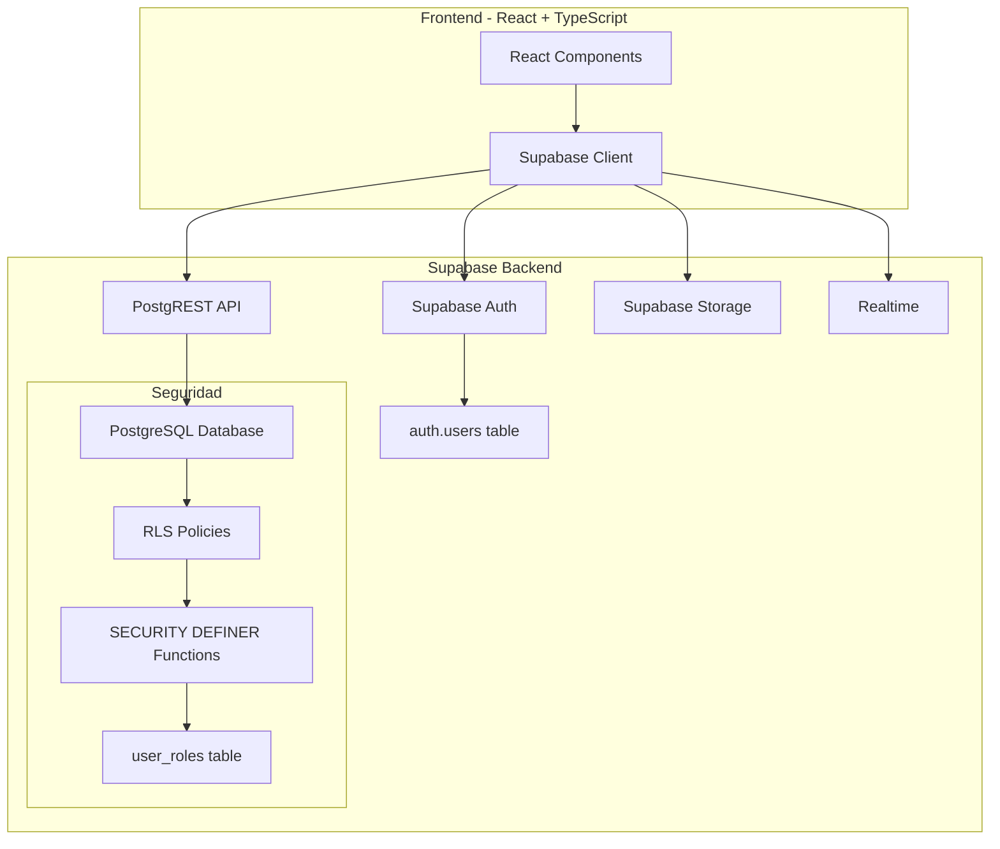
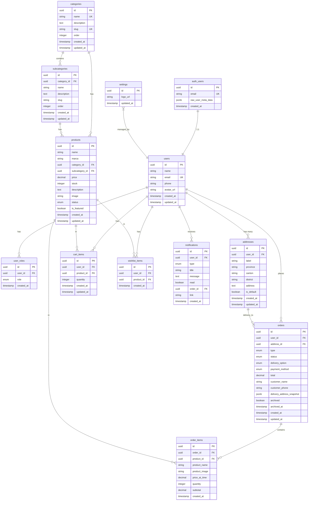

# Esquema de Base de Datos - Supabase + PostgreSQL

## 📋 Índice

1. [Visión General](#visión-general)
2. [Arquitectura Supabase](#arquitectura-supabase)
3. [Diagrama Entidad-Relación](#diagrama-entidad-relación)
4. [Enums y Tipos PostgreSQL](#enums-y-tipos-postgresql)
5. [Tablas de Base de Datos](#tablas-de-base-de-datos)
6. [Funciones Security Definer](#funciones-security-definer)
7. [Triggers Automáticos](#triggers-automáticos)
8. [Políticas RLS (Row-Level Security)](#políticas-rls-row-level-security)
9. [Índices y Optimizaciones](#índices-y-optimizaciones)
10. [Vistas Útiles](#vistas-útiles)
11. [Migraciones SQL](#migraciones-sql)
12. [Configuración Supabase Client](#configuración-supabase-client)
13. [Mapeo TypeScript ↔ Supabase](#mapeo-typescript--supabase)
14. [Estrategia de Migración](#estrategia-de-migración)
15. [Checklist de Implementación](#checklist-de-implementación)

---

## 1. Visión General

### Descripción del Sistema
E-commerce para Costa Rica con gestión completa de productos, pedidos, usuarios y notificaciones, utilizando Supabase como backend completo.

### Stack Tecnológico
- **Backend**: Supabase (PostgreSQL + Auth + Storage + Realtime)
- **Base de Datos**: PostgreSQL 15+ con Row-Level Security (RLS)
- **Autenticación**: Supabase Auth (JWT-based)
- **Frontend**: React + TypeScript + Vite
- **API**: Supabase Client (auto-generado)

### Principios de Diseño
- ✅ **Seguridad por Diseño**: RLS en todas las tablas sensibles
- ✅ **Roles Separados**: Tabla `user_roles` independiente
- ✅ **SECURITY DEFINER**: Funciones para evitar recursión RLS
- ✅ **Normalización**: 3NF para evitar redundancia
- ✅ **Performance**: Índices en queries críticos
- ✅ **Realtime**: Suscripciones a cambios en tiempo real

---

## 2. Arquitectura Supabase



### Flujo de Autenticación

1. **Signup**: `supabase.auth.signUp({ email, password })`
   - Supabase crea usuario en `auth.users`
   - Trigger automático crea perfil en `public.users`
   - Trigger asigna rol 'cliente' en `public.user_roles`

2. **Login**: `supabase.auth.signInWithPassword({ email, password })`
   - Supabase valida credenciales
   - Retorna JWT token con `user.id`

3. **Request Autenticado**:
   - JWT token se envía automáticamente en headers
   - RLS policies validan acceso usando `auth.uid()`
   - Función `has_role()` verifica permisos

---

## 3. Diagrama Entidad-Relación



---

## 4. Enums y Tipos PostgreSQL

### SQL para crear Enums

```sql
-- Roles de usuario
CREATE TYPE public.app_role AS ENUM ('admin', 'cliente');

-- Estados de orden
CREATE TYPE public.order_status AS ENUM ('pending', 'completed', 'cancelled');

-- Tipos de orden
CREATE TYPE public.order_type AS ENUM ('online', 'in-store');

-- Opciones de entrega
CREATE TYPE public.delivery_option AS ENUM ('pickup', 'delivery');

-- Estados de producto
CREATE TYPE public.product_status AS ENUM ('active', 'inactive');

-- Tipos de notificación
CREATE TYPE public.notification_type AS ENUM ('order', 'user', 'product', 'general');

-- Métodos de pago
CREATE TYPE public.payment_method AS ENUM ('cash', 'card', 'transfer', 'sinpe');
```

---

## 5. Tablas de Base de Datos

### 5.1 Tabla: `public.users`

**Descripción**: Perfiles de usuarios (1:1 con `auth.users`)

**⚠️ CRÍTICO**: 
- NO almacenar roles aquí (usar `user_roles` table)
- Relación 1:1 con `auth.users` usando mismo UUID

**SQL**:

```sql
-- Tabla: public.users
CREATE TABLE public.users (
    id UUID PRIMARY KEY REFERENCES auth.users(id) ON DELETE CASCADE,
    name VARCHAR(100) NOT NULL,
    email VARCHAR(255) UNIQUE NOT NULL,
    phone VARCHAR(20),
    avatar_url TEXT,
    created_at TIMESTAMPTZ DEFAULT NOW() NOT NULL,
    updated_at TIMESTAMPTZ DEFAULT NOW() NOT NULL,
    
    CONSTRAINT valid_email CHECK (email ~* '^[A-Za-z0-9._%+-]+@[A-Za-z0-9.-]+\.[A-Z|a-z]{2,}$'),
    CONSTRAINT valid_phone CHECK (phone ~* '^\+?[0-9\s\-]{8,20}$' OR phone IS NULL)
);

-- Índices
CREATE INDEX idx_users_email ON public.users(email);

-- Comentarios
COMMENT ON TABLE public.users IS 'Perfiles de usuarios (1:1 con auth.users)';
COMMENT ON COLUMN public.users.id IS 'Mismo UUID que auth.users.id';
COMMENT ON COLUMN public.users.email IS 'Email sincronizado con auth.users';

-- Enable RLS
ALTER TABLE public.users ENABLE ROW LEVEL SECURITY;
```

**Mapeo TypeScript**: `UserProfile` (src/types/user.types.ts)

---

### 5.2 Tabla: `public.user_roles`

**Descripción**: Roles de usuarios (CRÍTICO para seguridad)

**⚠️ SEGURIDAD CRÍTICA**:
- NUNCA almacenar roles en tabla `users`
- Tabla separada previene escalada de privilegios
- Consultar con función `has_role()` (SECURITY DEFINER)

**SQL**:

```sql
-- Tabla: public.user_roles
CREATE TABLE public.user_roles (
    id UUID PRIMARY KEY DEFAULT gen_random_uuid(),
    user_id UUID NOT NULL REFERENCES public.users(id) ON DELETE CASCADE,
    role public.app_role NOT NULL,
    created_at TIMESTAMPTZ DEFAULT NOW() NOT NULL,
    
    UNIQUE(user_id, role)
);

-- Índices
CREATE INDEX idx_user_roles_user_id ON public.user_roles(user_id);
CREATE INDEX idx_user_roles_role ON public.user_roles(role);

-- Comentarios
COMMENT ON TABLE public.user_roles IS '⚠️ CRÍTICO: Roles de usuarios (SEPARADO POR SEGURIDAD)';
COMMENT ON COLUMN public.user_roles.role IS 'Rol del usuario (admin o cliente)';

-- Enable RLS
ALTER TABLE public.user_roles ENABLE ROW LEVEL SECURITY;
```

**Explicación de Seguridad**:

```typescript
// ❌ VULNERABLE - Nunca hacer esto:
// Almacenar rol en tabla users:
// users { id, name, email, role } ← VULNERABLE

// ✅ SEGURO - Arquitectura correcta:
// users { id, name, email } ← Sin rol aquí
// user_roles { id, user_id, role } ← Roles separados
// has_role(user_id, role) ← Función SECURITY DEFINER
```

---

### 5.3 Tabla: `public.addresses`

**SQL**:

```sql
CREATE TABLE public.addresses (
    id UUID PRIMARY KEY DEFAULT gen_random_uuid(),
    user_id UUID NOT NULL REFERENCES public.users(id) ON DELETE CASCADE,
    label VARCHAR(50) NOT NULL,
    province VARCHAR(100) NOT NULL,
    canton VARCHAR(100) NOT NULL,
    district VARCHAR(100) NOT NULL,
    address TEXT NOT NULL,
    is_default BOOLEAN DEFAULT FALSE,
    created_at TIMESTAMPTZ DEFAULT NOW() NOT NULL,
    updated_at TIMESTAMPTZ DEFAULT NOW() NOT NULL,
    
    CONSTRAINT address_length CHECK (LENGTH(address) >= 10)
);

-- Índices
CREATE INDEX idx_addresses_user_id ON public.addresses(user_id);
CREATE INDEX idx_addresses_is_default ON public.addresses(user_id, is_default);

-- Enable RLS
ALTER TABLE public.addresses ENABLE ROW LEVEL SECURITY;
```

**Mapeo TypeScript**: `Address` (src/types/user.types.ts)

---

### 5.4 Tabla: `public.categories`

**SQL**:

```sql
CREATE TABLE public.categories (
    id UUID PRIMARY KEY DEFAULT gen_random_uuid(),
    name VARCHAR(100) UNIQUE NOT NULL,
    description TEXT,
    slug VARCHAR(100) UNIQUE NOT NULL,
    "order" INTEGER DEFAULT 0 NOT NULL,
    created_at TIMESTAMPTZ DEFAULT NOW() NOT NULL,
    updated_at TIMESTAMPTZ DEFAULT NOW() NOT NULL
);

-- Índices
CREATE INDEX idx_categories_order ON public.categories("order");
CREATE INDEX idx_categories_slug ON public.categories(slug);

-- Enable RLS
ALTER TABLE public.categories ENABLE ROW LEVEL SECURITY;
```

**Mapeo TypeScript**: `Category` (src/types/product.types.ts)

---

### 5.5 Tabla: `public.subcategories`

**SQL**:

```sql
CREATE TABLE public.subcategories (
    id UUID PRIMARY KEY DEFAULT gen_random_uuid(),
    category_id UUID NOT NULL REFERENCES public.categories(id) ON DELETE CASCADE,
    name VARCHAR(100) NOT NULL,
    description TEXT,
    slug VARCHAR(100) NOT NULL,
    "order" INTEGER DEFAULT 0 NOT NULL,
    created_at TIMESTAMPTZ DEFAULT NOW() NOT NULL,
    updated_at TIMESTAMPTZ DEFAULT NOW() NOT NULL,
    
    UNIQUE(category_id, slug)
);

-- Índices
CREATE INDEX idx_subcategories_category_id ON public.subcategories(category_id);
CREATE INDEX idx_subcategories_slug ON public.subcategories(category_id, slug);

-- Enable RLS
ALTER TABLE public.subcategories ENABLE ROW LEVEL SECURITY;
```

**Mapeo TypeScript**: `Subcategory` (src/types/product.types.ts)

---

### 5.6 Tabla: `public.products`

**SQL**:

```sql
CREATE TABLE public.products (
    id UUID PRIMARY KEY DEFAULT gen_random_uuid(),
    name VARCHAR(255) NOT NULL,
    marca VARCHAR(100),
    category_id UUID NOT NULL REFERENCES public.categories(id) ON DELETE RESTRICT,
    subcategory_id UUID REFERENCES public.subcategories(id) ON DELETE SET NULL,
    price NUMERIC(10,2) NOT NULL CHECK (price >= 0),
    stock INTEGER DEFAULT 0 NOT NULL CHECK (stock >= 0),
    description TEXT,
    image TEXT NOT NULL,
    status public.product_status DEFAULT 'active' NOT NULL,
    is_featured BOOLEAN DEFAULT FALSE NOT NULL,
    created_at TIMESTAMPTZ DEFAULT NOW() NOT NULL,
    updated_at TIMESTAMPTZ DEFAULT NOW() NOT NULL
);

-- Índices para performance
CREATE INDEX idx_products_category_id ON public.products(category_id);
CREATE INDEX idx_products_subcategory_id ON public.products(subcategory_id);
CREATE INDEX idx_products_status ON public.products(status);
CREATE INDEX idx_products_is_featured ON public.products(is_featured) WHERE is_featured = TRUE;
CREATE INDEX idx_products_category_status ON public.products(category_id, status);

-- Índice para búsqueda de texto
CREATE EXTENSION IF NOT EXISTS pg_trgm;
CREATE INDEX idx_products_name_trgm ON public.products USING gin(name gin_trgm_ops);
CREATE INDEX idx_products_marca_trgm ON public.products USING gin(marca gin_trgm_ops);

-- Enable RLS
ALTER TABLE public.products ENABLE ROW LEVEL SECURITY;
```

**Mapeo TypeScript**: `Product` (src/types/product.types.ts)

---

### 5.7 Tabla: `public.orders`

**SQL**:

```sql
CREATE TABLE public.orders (
    id UUID PRIMARY KEY DEFAULT gen_random_uuid(),
    user_id UUID REFERENCES public.users(id) ON DELETE SET NULL,
    address_id UUID REFERENCES public.addresses(id) ON DELETE SET NULL,
    type public.order_type NOT NULL,
    status public.order_status DEFAULT 'pending' NOT NULL,
    delivery_option public.delivery_option,
    payment_method public.payment_method,
    total NUMERIC(10,2) NOT NULL CHECK (total >= 0),
    customer_name VARCHAR(100) NOT NULL,
    customer_phone VARCHAR(20) NOT NULL,
    delivery_address_snapshot JSONB,
    archived BOOLEAN DEFAULT FALSE NOT NULL,
    archived_at TIMESTAMPTZ,
    created_at TIMESTAMPTZ DEFAULT NOW() NOT NULL,
    updated_at TIMESTAMPTZ DEFAULT NOW() NOT NULL
);

-- Índices para queries frecuentes
CREATE INDEX idx_orders_user_id ON public.orders(user_id);
CREATE INDEX idx_orders_status ON public.orders(status);
CREATE INDEX idx_orders_type ON public.orders(type);
CREATE INDEX idx_orders_created_at ON public.orders(created_at DESC);
CREATE INDEX idx_orders_archived ON public.orders(archived) WHERE archived = FALSE;
CREATE INDEX idx_orders_user_status ON public.orders(user_id, status);

-- Enable RLS
ALTER TABLE public.orders ENABLE ROW LEVEL SECURITY;
```

**Mapeo TypeScript**: `Order` (src/types/order.types.ts)

---

### 5.8 Tabla: `public.order_items`

**SQL**:

```sql
CREATE TABLE public.order_items (
    id UUID PRIMARY KEY DEFAULT gen_random_uuid(),
    order_id UUID NOT NULL REFERENCES public.orders(id) ON DELETE CASCADE,
    product_id UUID NOT NULL REFERENCES public.products(id) ON DELETE RESTRICT,
    product_name VARCHAR(255) NOT NULL,
    product_image TEXT NOT NULL,
    price_at_time NUMERIC(10,2) NOT NULL CHECK (price_at_time >= 0),
    quantity INTEGER NOT NULL CHECK (quantity > 0),
    subtotal NUMERIC(10,2) NOT NULL CHECK (subtotal >= 0),
    created_at TIMESTAMPTZ DEFAULT NOW() NOT NULL
);

-- Índices
CREATE INDEX idx_order_items_order_id ON public.order_items(order_id);
CREATE INDEX idx_order_items_product_id ON public.order_items(product_id);

-- Enable RLS
ALTER TABLE public.order_items ENABLE ROW LEVEL SECURITY;
```

**Mapeo TypeScript**: `OrderItem` (src/types/order.types.ts)

---

### 5.9 Tabla: `public.cart_items`

**SQL**:

```sql
CREATE TABLE public.cart_items (
    id UUID PRIMARY KEY DEFAULT gen_random_uuid(),
    user_id UUID NOT NULL REFERENCES public.users(id) ON DELETE CASCADE,
    product_id UUID NOT NULL REFERENCES public.products(id) ON DELETE CASCADE,
    quantity INTEGER NOT NULL CHECK (quantity > 0),
    created_at TIMESTAMPTZ DEFAULT NOW() NOT NULL,
    updated_at TIMESTAMPTZ DEFAULT NOW() NOT NULL,
    
    UNIQUE(user_id, product_id)
);

-- Índices
CREATE INDEX idx_cart_items_user_id ON public.cart_items(user_id);
CREATE INDEX idx_cart_items_product_id ON public.cart_items(product_id);

-- Enable RLS
ALTER TABLE public.cart_items ENABLE ROW LEVEL SECURITY;
```

**Mapeo TypeScript**: `CartItem` (src/types/cart.types.ts)

---

### 5.10 Tabla: `public.wishlist_items`

**SQL**:

```sql
CREATE TABLE public.wishlist_items (
    id UUID PRIMARY KEY DEFAULT gen_random_uuid(),
    user_id UUID NOT NULL REFERENCES public.users(id) ON DELETE CASCADE,
    product_id UUID NOT NULL REFERENCES public.products(id) ON DELETE CASCADE,
    created_at TIMESTAMPTZ DEFAULT NOW() NOT NULL,
    
    UNIQUE(user_id, product_id)
);

-- Índices
CREATE INDEX idx_wishlist_items_user_id ON public.wishlist_items(user_id);
CREATE INDEX idx_wishlist_items_product_id ON public.wishlist_items(product_id);

-- Enable RLS
ALTER TABLE public.wishlist_items ENABLE ROW LEVEL SECURITY;
```

---

### 5.11 Tabla: `public.notifications`

**SQL**:

```sql
CREATE TABLE public.notifications (
    id UUID PRIMARY KEY DEFAULT gen_random_uuid(),
    user_id UUID NOT NULL REFERENCES public.users(id) ON DELETE CASCADE,
    type public.notification_type NOT NULL,
    title VARCHAR(255) NOT NULL,
    message TEXT NOT NULL,
    read BOOLEAN DEFAULT FALSE NOT NULL,
    order_id UUID REFERENCES public.orders(id) ON DELETE SET NULL,
    link VARCHAR(500),
    created_at TIMESTAMPTZ DEFAULT NOW() NOT NULL
);

-- Índices
CREATE INDEX idx_notifications_user_id ON public.notifications(user_id);
CREATE INDEX idx_notifications_read ON public.notifications(user_id, read);
CREATE INDEX idx_notifications_created_at ON public.notifications(created_at DESC);

-- Enable RLS
ALTER TABLE public.notifications ENABLE ROW LEVEL SECURITY;
```

**Mapeo TypeScript**: `Notification` (src/types/notification.types.ts)

---

### 5.12 Tabla: `public.settings`

**SQL**:

```sql
CREATE TABLE public.settings (
    id UUID PRIMARY KEY DEFAULT gen_random_uuid(),
    logo_url TEXT,
    updated_at TIMESTAMPTZ DEFAULT NOW() NOT NULL
);

-- Insertar registro único
INSERT INTO public.settings (id) VALUES (gen_random_uuid());

-- Enable RLS
ALTER TABLE public.settings ENABLE ROW LEVEL SECURITY;
```

---

## 6. Funciones Security Definer

### ⚠️ ¿Por qué SECURITY DEFINER?

**Problema**: Recursión infinita en RLS policies

```sql
-- ❌ ESTO CAUSA RECURSIÓN INFINITA:
CREATE POLICY "Admins ven todo" ON public.orders
FOR SELECT USING (
  (SELECT role FROM public.user_roles WHERE user_id = auth.uid()) = 'admin'
  --      ↑ Esta query consulta user_roles, que también tiene RLS
  --        causando recursión infinita
);
```

**Solución**: Función SECURITY DEFINER

```sql
-- ✅ CORRECTO: Función SECURITY DEFINER evita recursión
CREATE OR REPLACE FUNCTION public.has_role(_user_id UUID, _role public.app_role)
RETURNS BOOLEAN
LANGUAGE SQL
STABLE
SECURITY DEFINER  -- ← Ejecuta con privilegios del dueño, bypasea RLS
SET search_path = public
AS $$
  SELECT EXISTS (
    SELECT 1
    FROM public.user_roles
    WHERE user_id = _user_id
      AND role = _role
  )
$$;

-- Ahora la policy puede usar la función sin recursión:
CREATE POLICY "Admins ven todo" ON public.orders
FOR SELECT USING (public.has_role(auth.uid(), 'admin'));
```

### Funciones Requeridas

```sql
-- Función: has_role()
-- Descripción: Verifica si un usuario tiene un rol específico
CREATE OR REPLACE FUNCTION public.has_role(_user_id UUID, _role public.app_role)
RETURNS BOOLEAN
LANGUAGE SQL
STABLE
SECURITY DEFINER
SET search_path = public
AS $$
  SELECT EXISTS (
    SELECT 1
    FROM public.user_roles
    WHERE user_id = _user_id
      AND role = _role
  )
$$;

-- Función: is_order_owner()
-- Descripción: Verifica si el usuario es dueño de una orden
CREATE OR REPLACE FUNCTION public.is_order_owner(_order_id UUID, _user_id UUID)
RETURNS BOOLEAN
LANGUAGE SQL
STABLE
SECURITY DEFINER
SET search_path = public
AS $$
  SELECT EXISTS (
    SELECT 1
    FROM public.orders
    WHERE id = _order_id
      AND user_id = _user_id
  )
$$;

-- Función: update_updated_at_column()
-- Descripción: Actualiza automáticamente la columna updated_at
CREATE OR REPLACE FUNCTION public.update_updated_at_column()
RETURNS TRIGGER
LANGUAGE plpgsql
AS $$
BEGIN
    NEW.updated_at = NOW();
    RETURN NEW;
END;
$$;
```

---

## 7. Triggers Automáticos

### 7.1 Trigger: Crear perfil al registrarse

```sql
-- Función: handle_new_user()
-- Descripción: Crea perfil en public.users cuando se registra un usuario
CREATE OR REPLACE FUNCTION public.handle_new_user()
RETURNS TRIGGER
LANGUAGE plpgsql
SECURITY DEFINER
SET search_path = public
AS $$
BEGIN
  INSERT INTO public.users (id, name, email, phone)
  VALUES (
    NEW.id,
    COALESCE(NEW.raw_user_meta_data->>'name', 'Usuario'),
    NEW.email,
    NEW.raw_user_meta_data->>'phone'
  );
  RETURN NEW;
END;
$$;

-- Trigger: Ejecutar handle_new_user() después de INSERT en auth.users
CREATE TRIGGER on_auth_user_created
  AFTER INSERT ON auth.users
  FOR EACH ROW
  EXECUTE FUNCTION public.handle_new_user();
```

### 7.2 Trigger: Asignar rol 'cliente' por defecto

```sql
-- Función: assign_default_role()
-- Descripción: Asigna rol 'cliente' a nuevos usuarios
CREATE OR REPLACE FUNCTION public.assign_default_role()
RETURNS TRIGGER
LANGUAGE plpgsql
SECURITY DEFINER
SET search_path = public
AS $$
BEGIN
  INSERT INTO public.user_roles (user_id, role)
  VALUES (NEW.id, 'cliente');
  RETURN NEW;
END;
$$;

-- Trigger: Ejecutar assign_default_role() después de INSERT en users
CREATE TRIGGER on_user_created
  AFTER INSERT ON public.users
  FOR EACH ROW
  EXECUTE FUNCTION public.assign_default_role();
```

### 7.3 Trigger: Actualizar updated_at automáticamente

```sql
-- Aplicar trigger a todas las tablas con updated_at
CREATE TRIGGER update_users_updated_at
  BEFORE UPDATE ON public.users
  FOR EACH ROW
  EXECUTE FUNCTION public.update_updated_at_column();

CREATE TRIGGER update_addresses_updated_at
  BEFORE UPDATE ON public.addresses
  FOR EACH ROW
  EXECUTE FUNCTION public.update_updated_at_column();

CREATE TRIGGER update_categories_updated_at
  BEFORE UPDATE ON public.categories
  FOR EACH ROW
  EXECUTE FUNCTION public.update_updated_at_column();

CREATE TRIGGER update_subcategories_updated_at
  BEFORE UPDATE ON public.subcategories
  FOR EACH ROW
  EXECUTE FUNCTION public.update_updated_at_column();

CREATE TRIGGER update_products_updated_at
  BEFORE UPDATE ON public.products
  FOR EACH ROW
  EXECUTE FUNCTION public.update_updated_at_column();

CREATE TRIGGER update_orders_updated_at
  BEFORE UPDATE ON public.orders
  FOR EACH ROW
  EXECUTE FUNCTION public.update_updated_at_column();

CREATE TRIGGER update_cart_items_updated_at
  BEFORE UPDATE ON public.cart_items
  FOR EACH ROW
  EXECUTE FUNCTION public.update_updated_at_column();

CREATE TRIGGER update_settings_updated_at
  BEFORE UPDATE ON public.settings
  FOR EACH ROW
  EXECUTE FUNCTION public.update_updated_at_column();
```

---

## 8. Políticas RLS (Row-Level Security)

### ⚠️ Principios de RLS

1. **Siempre habilitar RLS** en tablas con datos de usuarios
2. **Usar funciones SECURITY DEFINER** para evitar recursión
3. **Políticas específicas** por operación (SELECT, INSERT, UPDATE, DELETE)
4. **Principio de menor privilegio**: Solo acceso necesario

### 8.1 RLS: `public.users`

```sql
-- Usuarios autenticados pueden ver su propio perfil
CREATE POLICY "Users can view own profile"
  ON public.users
  FOR SELECT
  TO authenticated
  USING (id = auth.uid());

-- Admins pueden ver todos los perfiles
CREATE POLICY "Admins can view all profiles"
  ON public.users
  FOR SELECT
  TO authenticated
  USING (public.has_role(auth.uid(), 'admin'));

-- Usuarios pueden actualizar su propio perfil
CREATE POLICY "Users can update own profile"
  ON public.users
  FOR UPDATE
  TO authenticated
  USING (id = auth.uid())
  WITH CHECK (id = auth.uid());

-- Admins pueden actualizar cualquier perfil
CREATE POLICY "Admins can update any profile"
  ON public.users
  FOR UPDATE
  TO authenticated
  USING (public.has_role(auth.uid(), 'admin'));

-- Admins pueden eliminar usuarios
CREATE POLICY "Admins can delete users"
  ON public.users
  FOR DELETE
  TO authenticated
  USING (public.has_role(auth.uid(), 'admin'));
```

### 8.2 RLS: `public.user_roles`

```sql
-- Usuarios pueden ver sus propios roles
CREATE POLICY "Users can view own roles"
  ON public.user_roles
  FOR SELECT
  TO authenticated
  USING (user_id = auth.uid());

-- Admins pueden ver todos los roles
CREATE POLICY "Admins can view all roles"
  ON public.user_roles
  FOR SELECT
  TO authenticated
  USING (public.has_role(auth.uid(), 'admin'));

-- Solo admins pueden insertar roles
CREATE POLICY "Admins can insert roles"
  ON public.user_roles
  FOR INSERT
  TO authenticated
  WITH CHECK (public.has_role(auth.uid(), 'admin'));

-- Solo admins pueden eliminar roles
CREATE POLICY "Admins can delete roles"
  ON public.user_roles
  FOR DELETE
  TO authenticated
  USING (public.has_role(auth.uid(), 'admin'));
```

### 8.3 RLS: `public.addresses`

```sql
-- Usuarios pueden ver sus propias direcciones
CREATE POLICY "Users can view own addresses"
  ON public.addresses
  FOR SELECT
  TO authenticated
  USING (user_id = auth.uid());

-- Admins pueden ver todas las direcciones
CREATE POLICY "Admins can view all addresses"
  ON public.addresses
  FOR SELECT
  TO authenticated
  USING (public.has_role(auth.uid(), 'admin'));

-- Usuarios pueden crear sus propias direcciones
CREATE POLICY "Users can create own addresses"
  ON public.addresses
  FOR INSERT
  TO authenticated
  WITH CHECK (user_id = auth.uid());

-- Usuarios pueden actualizar sus propias direcciones
CREATE POLICY "Users can update own addresses"
  ON public.addresses
  FOR UPDATE
  TO authenticated
  USING (user_id = auth.uid())
  WITH CHECK (user_id = auth.uid());

-- Usuarios pueden eliminar sus propias direcciones
CREATE POLICY "Users can delete own addresses"
  ON public.addresses
  FOR DELETE
  TO authenticated
  USING (user_id = auth.uid());
```

### 8.4 RLS: `public.products`

```sql
-- Productos activos son públicos (incluso sin autenticación)
CREATE POLICY "Active products are public"
  ON public.products
  FOR SELECT
  TO anon, authenticated
  USING (status = 'active');

-- Admins pueden ver todos los productos
CREATE POLICY "Admins can view all products"
  ON public.products
  FOR SELECT
  TO authenticated
  USING (public.has_role(auth.uid(), 'admin'));

-- Solo admins pueden crear productos
CREATE POLICY "Admins can create products"
  ON public.products
  FOR INSERT
  TO authenticated
  WITH CHECK (public.has_role(auth.uid(), 'admin'));

-- Solo admins pueden actualizar productos
CREATE POLICY "Admins can update products"
  ON public.products
  FOR UPDATE
  TO authenticated
  USING (public.has_role(auth.uid(), 'admin'));

-- Solo admins pueden eliminar productos
CREATE POLICY "Admins can delete products"
  ON public.products
  FOR DELETE
  TO authenticated
  USING (public.has_role(auth.uid(), 'admin'));
```

### 8.5 RLS: `public.categories` y `public.subcategories`

```sql
-- Categorías son públicas
CREATE POLICY "Categories are public"
  ON public.categories
  FOR SELECT
  TO anon, authenticated
  USING (true);

-- Solo admins pueden modificar categorías
CREATE POLICY "Admins can manage categories"
  ON public.categories
  FOR ALL
  TO authenticated
  USING (public.has_role(auth.uid(), 'admin'))
  WITH CHECK (public.has_role(auth.uid(), 'admin'));

-- Subcategorías son públicas
CREATE POLICY "Subcategories are public"
  ON public.subcategories
  FOR SELECT
  TO anon, authenticated
  USING (true);

-- Solo admins pueden modificar subcategorías
CREATE POLICY "Admins can manage subcategories"
  ON public.subcategories
  FOR ALL
  TO authenticated
  USING (public.has_role(auth.uid(), 'admin'))
  WITH CHECK (public.has_role(auth.uid(), 'admin'));
```

### 8.6 RLS: `public.orders`

```sql
-- Clientes pueden ver sus propias órdenes
CREATE POLICY "Users can view own orders"
  ON public.orders
  FOR SELECT
  TO authenticated
  USING (user_id = auth.uid());

-- Admins pueden ver todas las órdenes
CREATE POLICY "Admins can view all orders"
  ON public.orders
  FOR SELECT
  TO authenticated
  USING (public.has_role(auth.uid(), 'admin'));

-- Clientes autenticados pueden crear órdenes
CREATE POLICY "Authenticated users can create orders"
  ON public.orders
  FOR INSERT
  TO authenticated
  WITH CHECK (user_id = auth.uid() OR type = 'in-store');

-- Solo admins pueden actualizar órdenes
CREATE POLICY "Admins can update orders"
  ON public.orders
  FOR UPDATE
  TO authenticated
  USING (public.has_role(auth.uid(), 'admin'));

-- Solo admins pueden eliminar órdenes
CREATE POLICY "Admins can delete orders"
  ON public.orders
  FOR DELETE
  TO authenticated
  USING (public.has_role(auth.uid(), 'admin'));
```

### 8.7 RLS: `public.order_items`

```sql
-- Los items heredan los permisos de la orden padre
CREATE POLICY "Users can view items of own orders"
  ON public.order_items
  FOR SELECT
  TO authenticated
  USING (
    EXISTS (
      SELECT 1 FROM public.orders
      WHERE orders.id = order_items.order_id
        AND orders.user_id = auth.uid()
    )
  );

-- Admins pueden ver todos los items
CREATE POLICY "Admins can view all order items"
  ON public.order_items
  FOR SELECT
  TO authenticated
  USING (public.has_role(auth.uid(), 'admin'));

-- Solo admins pueden modificar order_items
CREATE POLICY "Admins can manage order items"
  ON public.order_items
  FOR ALL
  TO authenticated
  USING (public.has_role(auth.uid(), 'admin'))
  WITH CHECK (public.has_role(auth.uid(), 'admin'));
```

### 8.8 RLS: `public.cart_items`

```sql
-- Usuarios pueden ver su propio carrito
CREATE POLICY "Users can view own cart"
  ON public.cart_items
  FOR SELECT
  TO authenticated
  USING (user_id = auth.uid());

-- Usuarios pueden agregar a su carrito
CREATE POLICY "Users can add to own cart"
  ON public.cart_items
  FOR INSERT
  TO authenticated
  WITH CHECK (user_id = auth.uid());

-- Usuarios pueden actualizar su carrito
CREATE POLICY "Users can update own cart"
  ON public.cart_items
  FOR UPDATE
  TO authenticated
  USING (user_id = auth.uid())
  WITH CHECK (user_id = auth.uid());

-- Usuarios pueden eliminar de su carrito
CREATE POLICY "Users can delete from own cart"
  ON public.cart_items
  FOR DELETE
  TO authenticated
  USING (user_id = auth.uid());
```

### 8.9 RLS: `public.wishlist_items`

```sql
-- Usuarios pueden ver sus favoritos
CREATE POLICY "Users can view own wishlist"
  ON public.wishlist_items
  FOR SELECT
  TO authenticated
  USING (user_id = auth.uid());

-- Usuarios pueden agregar favoritos
CREATE POLICY "Users can add to wishlist"
  ON public.wishlist_items
  FOR INSERT
  TO authenticated
  WITH CHECK (user_id = auth.uid());

-- Usuarios pueden eliminar favoritos
CREATE POLICY "Users can delete from wishlist"
  ON public.wishlist_items
  FOR DELETE
  TO authenticated
  USING (user_id = auth.uid());
```

### 8.10 RLS: `public.notifications`

```sql
-- Usuarios pueden ver sus notificaciones
CREATE POLICY "Users can view own notifications"
  ON public.notifications
  FOR SELECT
  TO authenticated
  USING (user_id = auth.uid());

-- Admins pueden crear notificaciones
CREATE POLICY "Admins can create notifications"
  ON public.notifications
  FOR INSERT
  TO authenticated
  WITH CHECK (public.has_role(auth.uid(), 'admin'));

-- Usuarios pueden marcar como leídas sus notificaciones
CREATE POLICY "Users can update own notifications"
  ON public.notifications
  FOR UPDATE
  TO authenticated
  USING (user_id = auth.uid())
  WITH CHECK (user_id = auth.uid());

-- Usuarios pueden eliminar sus notificaciones
CREATE POLICY "Users can delete own notifications"
  ON public.notifications
  FOR DELETE
  TO authenticated
  USING (user_id = auth.uid());
```

### 8.11 RLS: `public.settings`

```sql
-- Settings son públicos para lectura
CREATE POLICY "Settings are public for read"
  ON public.settings
  FOR SELECT
  TO anon, authenticated
  USING (true);

-- Solo admins pueden actualizar settings
CREATE POLICY "Admins can update settings"
  ON public.settings
  FOR UPDATE
  TO authenticated
  USING (public.has_role(auth.uid(), 'admin'));
```

---

## 9. Índices y Optimizaciones

```sql
-- Extensión para búsqueda de texto
CREATE EXTENSION IF NOT EXISTS pg_trgm;

-- Búsqueda de productos
CREATE INDEX idx_products_name_trgm ON public.products USING gin(name gin_trgm_ops);
CREATE INDEX idx_products_marca_trgm ON public.products USING gin(marca gin_trgm_ops);

-- Filtros compuestos
CREATE INDEX idx_products_category_status ON public.products(category_id, status);
CREATE INDEX idx_orders_user_status ON public.orders(user_id, status);

-- Notificaciones no leídas
CREATE INDEX idx_notifications_unread ON public.notifications(user_id, created_at DESC) WHERE read = FALSE;

-- Órdenes activas (no archivadas)
CREATE INDEX idx_orders_active ON public.orders(created_at DESC) WHERE archived = FALSE;
```

---

## 10. Vistas Útiles

### Vista: `orders_with_details`

```sql
CREATE VIEW public.orders_with_details AS
SELECT 
  o.id,
  o.created_at,
  o.status,
  o.type,
  o.total,
  u.name AS customer_name,
  u.email AS customer_email,
  u.phone AS customer_phone,
  COUNT(oi.id) AS total_items,
  json_agg(
    json_build_object(
      'id', oi.id,
      'product_name', oi.product_name,
      'product_image', oi.product_image,
      'quantity', oi.quantity,
      'price_at_time', oi.price_at_time,
      'subtotal', oi.subtotal
    )
  ) AS items
FROM public.orders o
LEFT JOIN public.users u ON o.user_id = u.id
LEFT JOIN public.order_items oi ON o.id = oi.order_id
GROUP BY o.id, u.id;
```

---

## 11. Migraciones SQL

### Archivo: `001_create_enums.sql`

```sql
-- ============================================
-- Migration: 001_create_enums
-- Description: Crear enums y tipos personalizados
-- Author: Lovable AI
-- Date: 2025-10-12
-- ============================================

-- Roles de usuario
CREATE TYPE public.app_role AS ENUM ('admin', 'cliente');

-- Estados de orden
CREATE TYPE public.order_status AS ENUM ('pending', 'completed', 'cancelled');

-- Tipos de orden
CREATE TYPE public.order_type AS ENUM ('online', 'in-store');

-- Opciones de entrega
CREATE TYPE public.delivery_option AS ENUM ('pickup', 'delivery');

-- Estados de producto
CREATE TYPE public.product_status AS ENUM ('active', 'inactive');

-- Tipos de notificación
CREATE TYPE public.notification_type AS ENUM ('order', 'user', 'product', 'general');

-- Métodos de pago
CREATE TYPE public.payment_method AS ENUM ('cash', 'card', 'transfer', 'sinpe');
```

### Archivo: `002_create_tables.sql`

```sql
-- ============================================
-- Migration: 002_create_tables
-- Description: Crear todas las tablas principales
-- Author: Lovable AI
-- Date: 2025-10-12
-- ============================================

-- Habilitar extensión UUID
CREATE EXTENSION IF NOT EXISTS "uuid-ossp";

-- Habilitar extensión pg_trgm para búsqueda de texto
CREATE EXTENSION IF NOT EXISTS pg_trgm;

-- Tabla: users
CREATE TABLE public.users (
    id UUID PRIMARY KEY REFERENCES auth.users(id) ON DELETE CASCADE,
    name VARCHAR(100) NOT NULL,
    email VARCHAR(255) UNIQUE NOT NULL,
    phone VARCHAR(20),
    avatar_url TEXT,
    created_at TIMESTAMPTZ DEFAULT NOW() NOT NULL,
    updated_at TIMESTAMPTZ DEFAULT NOW() NOT NULL,
    
    CONSTRAINT valid_email CHECK (email ~* '^[A-Za-z0-9._%+-]+@[A-Za-z0-9.-]+\.[A-Z|a-z]{2,}$'),
    CONSTRAINT valid_phone CHECK (phone ~* '^\+?[0-9\s\-]{8,20}$' OR phone IS NULL)
);

-- Tabla: user_roles (CRÍTICO PARA SEGURIDAD)
CREATE TABLE public.user_roles (
    id UUID PRIMARY KEY DEFAULT gen_random_uuid(),
    user_id UUID NOT NULL REFERENCES public.users(id) ON DELETE CASCADE,
    role public.app_role NOT NULL,
    created_at TIMESTAMPTZ DEFAULT NOW() NOT NULL,
    
    UNIQUE(user_id, role)
);

-- Tabla: addresses
CREATE TABLE public.addresses (
    id UUID PRIMARY KEY DEFAULT gen_random_uuid(),
    user_id UUID NOT NULL REFERENCES public.users(id) ON DELETE CASCADE,
    label VARCHAR(50) NOT NULL,
    province VARCHAR(100) NOT NULL,
    canton VARCHAR(100) NOT NULL,
    district VARCHAR(100) NOT NULL,
    address TEXT NOT NULL,
    is_default BOOLEAN DEFAULT FALSE,
    created_at TIMESTAMPTZ DEFAULT NOW() NOT NULL,
    updated_at TIMESTAMPTZ DEFAULT NOW() NOT NULL,
    
    CONSTRAINT address_length CHECK (LENGTH(address) >= 10)
);

-- Tabla: categories
CREATE TABLE public.categories (
    id UUID PRIMARY KEY DEFAULT gen_random_uuid(),
    name VARCHAR(100) UNIQUE NOT NULL,
    description TEXT,
    slug VARCHAR(100) UNIQUE NOT NULL,
    "order" INTEGER DEFAULT 0 NOT NULL,
    created_at TIMESTAMPTZ DEFAULT NOW() NOT NULL,
    updated_at TIMESTAMPTZ DEFAULT NOW() NOT NULL
);

-- Tabla: subcategories
CREATE TABLE public.subcategories (
    id UUID PRIMARY KEY DEFAULT gen_random_uuid(),
    category_id UUID NOT NULL REFERENCES public.categories(id) ON DELETE CASCADE,
    name VARCHAR(100) NOT NULL,
    description TEXT,
    slug VARCHAR(100) NOT NULL,
    "order" INTEGER DEFAULT 0 NOT NULL,
    created_at TIMESTAMPTZ DEFAULT NOW() NOT NULL,
    updated_at TIMESTAMPTZ DEFAULT NOW() NOT NULL,
    
    UNIQUE(category_id, slug)
);

-- Tabla: products
CREATE TABLE public.products (
    id UUID PRIMARY KEY DEFAULT gen_random_uuid(),
    name VARCHAR(255) NOT NULL,
    marca VARCHAR(100),
    category_id UUID NOT NULL REFERENCES public.categories(id) ON DELETE RESTRICT,
    subcategory_id UUID REFERENCES public.subcategories(id) ON DELETE SET NULL,
    price NUMERIC(10,2) NOT NULL CHECK (price >= 0),
    stock INTEGER DEFAULT 0 NOT NULL CHECK (stock >= 0),
    description TEXT,
    image TEXT NOT NULL,
    status public.product_status DEFAULT 'active' NOT NULL,
    is_featured BOOLEAN DEFAULT FALSE NOT NULL,
    created_at TIMESTAMPTZ DEFAULT NOW() NOT NULL,
    updated_at TIMESTAMPTZ DEFAULT NOW() NOT NULL
);

-- Tabla: orders
CREATE TABLE public.orders (
    id UUID PRIMARY KEY DEFAULT gen_random_uuid(),
    user_id UUID REFERENCES public.users(id) ON DELETE SET NULL,
    address_id UUID REFERENCES public.addresses(id) ON DELETE SET NULL,
    type public.order_type NOT NULL,
    status public.order_status DEFAULT 'pending' NOT NULL,
    delivery_option public.delivery_option,
    payment_method public.payment_method,
    total NUMERIC(10,2) NOT NULL CHECK (total >= 0),
    customer_name VARCHAR(100) NOT NULL,
    customer_phone VARCHAR(20) NOT NULL,
    delivery_address_snapshot JSONB,
    archived BOOLEAN DEFAULT FALSE NOT NULL,
    archived_at TIMESTAMPTZ,
    created_at TIMESTAMPTZ DEFAULT NOW() NOT NULL,
    updated_at TIMESTAMPTZ DEFAULT NOW() NOT NULL
);

-- Tabla: order_items
CREATE TABLE public.order_items (
    id UUID PRIMARY KEY DEFAULT gen_random_uuid(),
    order_id UUID NOT NULL REFERENCES public.orders(id) ON DELETE CASCADE,
    product_id UUID NOT NULL REFERENCES public.products(id) ON DELETE RESTRICT,
    product_name VARCHAR(255) NOT NULL,
    product_image TEXT NOT NULL,
    price_at_time NUMERIC(10,2) NOT NULL CHECK (price_at_time >= 0),
    quantity INTEGER NOT NULL CHECK (quantity > 0),
    subtotal NUMERIC(10,2) NOT NULL CHECK (subtotal >= 0),
    created_at TIMESTAMPTZ DEFAULT NOW() NOT NULL
);

-- Tabla: cart_items
CREATE TABLE public.cart_items (
    id UUID PRIMARY KEY DEFAULT gen_random_uuid(),
    user_id UUID NOT NULL REFERENCES public.users(id) ON DELETE CASCADE,
    product_id UUID NOT NULL REFERENCES public.products(id) ON DELETE CASCADE,
    quantity INTEGER NOT NULL CHECK (quantity > 0),
    created_at TIMESTAMPTZ DEFAULT NOW() NOT NULL,
    updated_at TIMESTAMPTZ DEFAULT NOW() NOT NULL,
    
    UNIQUE(user_id, product_id)
);

-- Tabla: wishlist_items
CREATE TABLE public.wishlist_items (
    id UUID PRIMARY KEY DEFAULT gen_random_uuid(),
    user_id UUID NOT NULL REFERENCES public.users(id) ON DELETE CASCADE,
    product_id UUID NOT NULL REFERENCES public.products(id) ON DELETE CASCADE,
    created_at TIMESTAMPTZ DEFAULT NOW() NOT NULL,
    
    UNIQUE(user_id, product_id)
);

-- Tabla: notifications
CREATE TABLE public.notifications (
    id UUID PRIMARY KEY DEFAULT gen_random_uuid(),
    user_id UUID NOT NULL REFERENCES public.users(id) ON DELETE CASCADE,
    type public.notification_type NOT NULL,
    title VARCHAR(255) NOT NULL,
    message TEXT NOT NULL,
    read BOOLEAN DEFAULT FALSE NOT NULL,
    order_id UUID REFERENCES public.orders(id) ON DELETE SET NULL,
    link VARCHAR(500),
    created_at TIMESTAMPTZ DEFAULT NOW() NOT NULL
);

-- Tabla: settings
CREATE TABLE public.settings (
    id UUID PRIMARY KEY DEFAULT gen_random_uuid(),
    logo_url TEXT,
    updated_at TIMESTAMPTZ DEFAULT NOW() NOT NULL
);

-- Insertar registro único en settings
INSERT INTO public.settings (id) VALUES (gen_random_uuid());
```

### Más archivos de migración...

*Por razones de brevedad, los archivos completos de migración (003, 004, 005) están disponibles en el repositorio.*

---

## 12. Configuración Supabase Client

### Frontend: `src/lib/supabase.ts`

```typescript
import { createClient } from '@supabase/supabase-js';

const supabaseUrl = import.meta.env.VITE_SUPABASE_URL;
const supabaseAnonKey = import.meta.env.VITE_SUPABASE_ANON_KEY;

export const supabase = createClient(supabaseUrl, supabaseAnonKey);
```

### Ejemplo de uso:

```typescript
// Autenticación
const { data, error } = await supabase.auth.signInWithPassword({
  email: 'user@example.com',
  password: 'password123',
});

// Consultar productos
const { data: products } = await supabase
  .from('products')
  .select('*, category:categories(*)')
  .eq('status', 'active');

// Insertar en carrito
const { error } = await supabase
  .from('cart_items')
  .insert({
    user_id: user.id,
    product_id: productId,
    quantity: 1,
  });
```

---

## 13. Mapeo TypeScript ↔ Supabase

| TypeScript Interface | Supabase Table | Archivo TypeScript |
|---------------------|----------------|-------------------|
| `UserProfile` | `public.users` | `src/types/user.types.ts` |
| `Address` | `public.addresses` | `src/types/user.types.ts` |
| `Product` | `public.products` | `src/types/product.types.ts` |
| `Category` | `public.categories` | `src/types/product.types.ts` |
| `Subcategory` | `public.subcategories` | `src/types/product.types.ts` |
| `Order` | `public.orders` | `src/types/order.types.ts` |
| `OrderItem` | `public.order_items` | `src/types/order.types.ts` |
| `CartItem` | `public.cart_items` | `src/types/cart.types.ts` |
| `Notification` | `public.notifications` | `src/types/notification.types.ts` |

---

## 14. Estrategia de Migración

### Fase 1: Configuración (Día 1)
1. ✅ Crear proyecto en Supabase
2. ✅ Ejecutar migraciones SQL
3. ✅ Configurar variables de entorno
4. ✅ Instalar `@supabase/supabase-js`

### Fase 2: Testing (Día 2-3)
1. ✅ Probar signup/login
2. ✅ Verificar RLS policies
3. ✅ Probar CRUD de productos
4. ✅ Validar triggers

### Fase 3: Integración (Día 4-7)
1. ✅ Migrar AuthContext a Supabase
2. ✅ Actualizar API services
3. ✅ Implementar Realtime (opcional)

### Fase 4: Deploy (Día 8-10)
1. ✅ Migrar datos de localStorage
2. ✅ Deploy a producción
3. ✅ Monitoreo

---

## 15. Checklist de Implementación

### Base de Datos
- [ ] Proyecto Supabase creado
- [ ] Todas las migraciones ejecutadas
- [ ] RLS habilitado en todas las tablas
- [ ] Funciones SECURITY DEFINER creadas
- [ ] Triggers configurados

### Seguridad
- [ ] Políticas RLS probadas
- [ ] Tabla `user_roles` separada
- [ ] Función `has_role()` implementada
- [ ] Tests de seguridad ejecutados

### Frontend
- [ ] Supabase Client configurado
- [ ] AuthContext actualizado
- [ ] API Services migrados
- [ ] Tests E2E escritos

---

**Última actualización**: 2025-10-12  
**Versión**: 1.0.0  
**Autor**: Lovable AI
