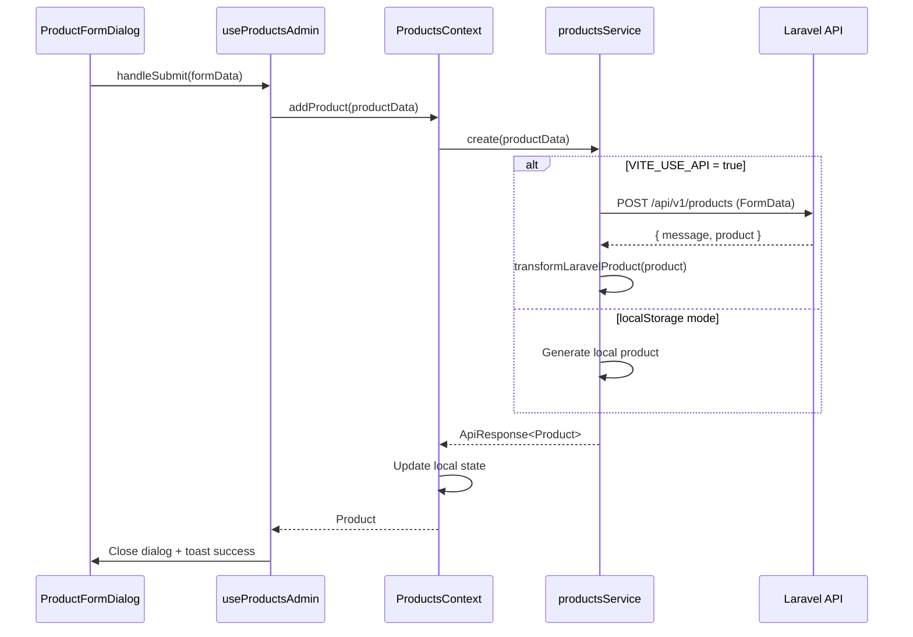
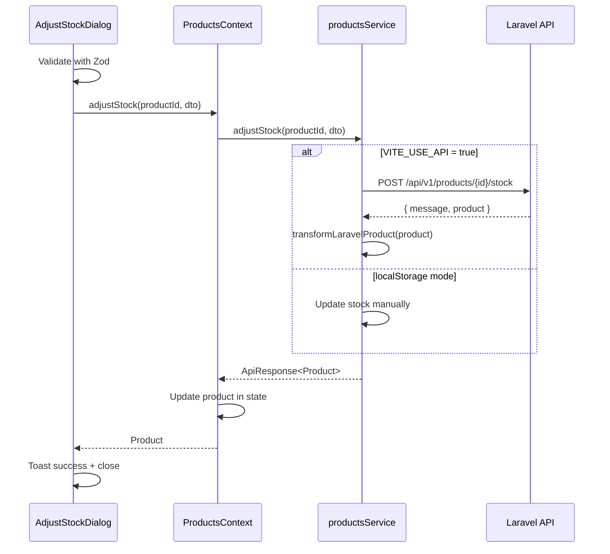

# Products & Stock Movement Module - Laravel Integration

## 📋 Tabla de Contenidos

1. [Descripción General](#descripción-general)
2. [Arquitectura del Módulo](#arquitectura-del-módulo)
3. [Tipos y Estructuras de Datos](#tipos-y-estructuras-de-datos)
4. [Servicios](#servicios)
5. [Contextos](#contextos)
6. [Hooks](#hooks)
7. [Componentes UI](#componentes-ui)
8. [Flujo de Datos](#flujo-de-datos)
9. [Integración con Orders](#integración-con-orders)
10. [Configuración Laravel](#configuración-laravel)
11. [Estado de Preparación](#estado-de-preparación)
12. [Ejemplos de Uso](#ejemplos-de-uso)

---

## Descripción General

El módulo **Products & Stock Movement** gestiona el catálogo completo de productos y el sistema de trazabilidad de inventario. Implementa un sistema robusto de control de stock con:

- ✅ **CRUD completo de productos** con validación Zod
- ✅ **Sistema de soft deletes** (papelera con restauración)
- ✅ **Trazabilidad completa** de movimientos de inventario
- ✅ **Reservas automáticas** al crear órdenes pendientes
- ✅ **Confirmación de ventas** al completar órdenes
- ✅ **Ajustes manuales** de stock con historial
- ✅ **Validación de disponibilidad** antes de crear órdenes
- ✅ **Integración Laravel** lista con toggle API

**Estado Actual:** 98% preparado para Laravel backend

---

## Arquitectura del Módulo

```
src/features/products/
├── components/
│   ├── ProductCard.tsx                  # Card público (vista cliente)
│   ├── ProductCardAdmin.tsx             # Card admin con acciones stock
│   ├── ProductDetailModal.tsx           # Modal detalle producto
│   ├── ProductFilters.tsx               # Filtros búsqueda y categoría
│   ├── ProductFormDialog.tsx            # Form crear/editar producto
│   ├── ProductGrid.tsx                  # Grid responsive productos
│   ├── ProductImageUpload.tsx           # Upload y preview imagen
│   ├── ProductRow.tsx                   # Fila tabla desktop
│   ├── ProductsListAdmin.tsx            # Lista admin (wrapper table/cards)
│   ├── ProductsTable.tsx                # Tabla desktop productos
│   ├── ProductRecycleBin.tsx            # Papelera soft-deleted
│   ├── AdjustStockDialog.tsx            # Dialog ajuste manual stock ✨ NEW
│   ├── StockMovementHistory.tsx         # Historial movimientos ✨ NEW
│   ├── FeaturedProducts.tsx             # Productos destacados home
│   ├── FeaturedProductsSection.tsx      # Sección destacados
│   └── SearchDialog.tsx                 # Buscador global
│
├── contexts/
│   └── ProductsContext.tsx              # Context provider con stock methods
│
├── hooks/
│   ├── useProductsAdmin.ts              # Hook admin CRUD products
│   ├── useProductOperations.ts          # Hook operaciones productos
│   ├── useProductFilters.ts             # Hook filtros y búsqueda
│   ├── useProductModal.ts               # Hook modal detalle
│   ├── useProductRecycleBin.ts          # Hook papelera ✨ NEW
│   └── useStockManagement.ts            # Hook gestión stock ✨ NEW
│
├── services/
│   ├── products.service.ts              # API products CRUD + stock
│   └── stock-movements.service.ts       # API stock tracking ✨ NEW
│
├── types/
│   ├── product.types.ts                 # Product, CreateProductDto, etc.
│   ├── stock-movement.types.ts          # StockMovement types ✨ NEW
│   └── index.ts                         # Exports
│
├── utils/
│   ├── transformers.ts                  # Laravel ↔ Frontend transformers
│   └── index.ts                         # Exports
│
├── validations/
│   └── product.validation.ts            # Zod schemas
│
└── index.ts                             # Public API
```

---

## Tipos y Estructuras de Datos

### Product Interface

```typescript
export interface Product {
  // IDs (transformed from Laravel numbers to strings)
  id: string;
  category_id: string;                    // Renamed from categoryId
  
  // Core fields
  name: string;
  slug: string;                           // NEW - Auto-generated by backend
  brand: string | null;                   // Renamed from "marca"
  description: string | null;
  sku: string | null;                     // NEW - Unique product code
  
  // Pricing & Stock
  price: number;                          // decimal(10,2) in backend
  stock: number;
  
  // Media
  image_url: string | null;               // Renamed from "image"
  
  // Status
  status: ProductStatus;                  // 'active' | 'inactive' | 'out_of_stock'
  is_featured: boolean;                   // Renamed from isFeatured
  
  // Soft delete
  deleted_at: string | null;              // NEW - For recycle bin
  
  // Timestamps
  created_at: string;                     // Renamed from createdAt
  updated_at: string;                     // NEW
  
  // Eager loaded relations (optional)
  category?: Category;                    // NEW - Full category object
  stock_movements?: StockMovement[];      // NEW - Stock history
  stock_movements_count?: number;         // NEW - Movement counter
}
```

### StockMovement Interface

```typescript
export interface StockMovement {
  id: string;                             // Transformed from number
  product_id: string;                     // Transformed from number
  type: StockMovementType;                // See below
  quantity: number;                       // Negative for exits/sales
  stock_before: number;
  stock_after: number;
  reason: string | null;
  user_id: string;                        // Transformed from number
  order_id: string | null;                // Transformed from number (optional)
  created_at: string;
  updated_at: string;
  
  // Eager loaded relations (optional)
  product?: Product;
  user?: any;                             // User type from auth module
  order?: Order;
}
```

### StockMovementType

```typescript
export type StockMovementType = 
  | 'entrada'              // Stock entry/purchase
  | 'salida'               // Manual exit
  | 'ajuste'               // Inventory adjustment/correction
  | 'reserva'              // Reservation for pending order
  | 'venta'                // Confirmed sale (deducts real stock)
  | 'cancelacion_reserva'; // Release reservation on order cancellation
```

### DTOs

```typescript
// Create product
export interface CreateProductDto {
  name: string;
  category_id: string;
  brand?: string | null;
  description?: string | null;
  sku?: string | null;
  price: number;
  stock: number;
  image?: File;                           // For upload
  status: ProductStatus;
  is_featured?: boolean;
}

// Update product
export interface UpdateProductDto extends Partial<CreateProductDto> {}

// Adjust stock
export interface AdjustStockDto {
  type: 'entrada' | 'salida' | 'ajuste';
  quantity: number;
  reason?: string;
}

// Reserve stock
export interface ReserveStockDto {
  order_id: string;
  items: Array<{
    product_id: string;
    quantity: number;
  }>;
}

// Stock availability
export interface StockAvailability {
  available: boolean;
  errors: StockAvailabilityError[];
}

export interface StockAvailabilityError {
  product_id: string;
  product_name: string;
  requested: number;
  available: number;
  message: string;
}
```

---

## Servicios

### productsService

**Path:** `src/features/products/services/products.service.ts`

#### Métodos Principales

```typescript
// CRUD Operations
getAll(filters?: ProductFilters): Promise<PaginatedResponse<Product>>
getPaginated(params: PaginationParams): Promise<PaginatedResponse<Product>>
getById(id: string): Promise<Product>
getFeatured(): Promise<Product[]>
create(data: CreateProductDto): Promise<ApiResponse<Product>>
update(id: string, data: UpdateProductDto): Promise<ApiResponse<Product>>
delete(id: string): Promise<ApiResponse<void>>           // Soft delete

// Recycle Bin Operations ✨ NEW
getDeleted(): Promise<ApiResponse<Product[]>>            // Get soft-deleted products
restore(id: string): Promise<ApiResponse<Product>>       // Restore deleted product
forceDelete(id: string): Promise<ApiResponse<void>>      // Permanent deletion

// Stock Operations ✨ NEW
adjustStock(id: string, data: AdjustStockDto): Promise<ApiResponse<Product>>
```

#### Laravel Endpoints

```
GET    /api/v1/products                    # List products (paginated)
GET    /api/v1/products/featured           # Featured products
GET    /api/v1/products/{id}               # Single product
POST   /api/v1/products                    # Create (FormData with image)
PUT    /api/v1/products/{id}               # Update (FormData with _method=PUT)
DELETE /api/v1/products/{id}               # Soft delete
DELETE /api/v1/products/{id}/force         # Force delete (permanent)
POST   /api/v1/products/{id}/restore       # Restore deleted
POST   /api/v1/products/{id}/stock         # Adjust stock
GET    /api/v1/products/deleted            # Soft-deleted products
```

#### Transformers

```typescript
// Laravel → Frontend
transformLaravelProduct(laravelProduct: any): Product
transformLaravelProducts(laravelProducts: any[]): Product[]
transformLaravelPaginatedProducts(laravelResponse: any): PaginatedResponse<Product>

// Frontend → Laravel
transformToLaravelProductPayload(productData: Partial<Product>): any
```

**Transformaciones clave:**
- `id: number` → `id: string`
- `category_id: number` → `category_id: string`
- Field name mapping (image → image_url, marca → brand, etc.)
- Eager-loaded relations handling

---

### stockMovementsService

**Path:** `src/features/products/services/stock-movements.service.ts`

#### Métodos Principales

```typescript
// Query movements
getByProduct(productId: string): Promise<StockMovement[]>
getAll(filters?: StockMovementFilters): Promise<StockMovement[]>

// Stock validation
checkAvailability(items: Array<{product_id: string, quantity: number}>): Promise<StockAvailability>

// Stock operations (used by OrdersContext)
reserveStock(dto: ReserveStockDto): Promise<void>
confirmSale(orderId: string): Promise<void>
cancelReservation(orderId: string): Promise<void>

// Manual adjustment
adjustStock(productId: string, dto: AdjustStockDto): Promise<StockMovement>
```

#### Laravel Endpoints

```
GET  /api/v1/products/{id}/stock-movements          # Product movements
GET  /api/v1/stock-movements                        # All movements (filtered)
POST /api/v1/stock-movements/check-availability     # Validate stock
POST /api/v1/stock-movements/reserve                # Reserve for order
POST /api/v1/stock-movements/confirm-sale/{orderId} # Confirm sale
POST /api/v1/stock-movements/cancel-reservation/{orderId} # Cancel reservation
POST /api/v1/products/{id}/stock                    # Manual adjustment
```

#### Filters

```typescript
export interface StockMovementFilters {
  product_id?: string;
  type?: string;
  user_id?: string;
  order_id?: string;
  from_date?: string;
  to_date?: string;
  page?: number;
  per_page?: number;
}
```

---

## Contextos

### ProductsContext

**Path:** `src/features/products/contexts/ProductsContext.tsx`

#### Provider

```tsx
<ProductsProvider>
  {children}
</ProductsProvider>
```

#### Interface

```typescript
interface ProductsContextType {
  products: Product[];
  loading: boolean;
  
  // CRUD operations
  addProduct: (product: Omit<Product, 'id' | 'created_at' | 'updated_at' | 'deleted_at'>) => Promise<Product>;
  updateProduct: (id: string, product: Partial<Product>) => Promise<Product>;
  deleteProduct: (id: string) => Promise<void>;
  
  // Recycle bin ✨ NEW
  restoreProduct: (id: string) => Promise<Product>;
  forceDeleteProduct: (id: string) => Promise<void>;
  getDeletedProducts: () => Promise<Product[]>;
  
  // Stock management ✨ NEW
  adjustStock: (productId: string, dto: AdjustStockDto) => Promise<Product>;
  
  // Queries
  getProductsByCategory: (categoryId: string) => Product[];
  getProductsBySubcategory: (subcategoryId: string) => Product[]; // Deprecated
}
```

#### Uso

```tsx
const { products, loading, addProduct, adjustStock } = useProducts();
```

---

## Hooks

### useProductsAdmin

**Path:** `src/features/products/hooks/useProductsAdmin.ts`

Hook principal para la página de administración de productos.

```typescript
const {
  // Data
  categories,
  filteredProducts,
  filterSummary,
  
  // Filters
  searchQuery,
  setSearchQuery,
  selectedCategory,
  setSelectedCategory,
  resetFilters,
  
  // Dialog states
  isAddDialogOpen,
  setIsAddDialogOpen,
  isEditDialogOpen,
  setIsEditDialogOpen,
  deleteProductDialog,
  setDeleteProductDialog,
  
  // Form state
  selectedImage,
  setSelectedImage,
  formData,
  setFormData,
  availableSubcategories,
  
  // Handlers
  handleImageUpload,
  handleRemoveImage,
  handleEditProduct,
  handleSubmit,
  handleUpdateProduct,
  openDeleteProductDialog,
  confirmDeleteProduct,
  handleToggleFeatured,
  handleOpenAddDialog,
} = useProductsAdmin();
```

### useStockManagement

**Path:** `src/features/products/hooks/useStockManagement.ts`

Hook para gestionar dialogs de stock (ajuste manual e historial).

```typescript
const {
  adjustStockDialog,           // { open: boolean, product: Product | null }
  openAdjustStockDialog,       // (product: Product) => void
  closeAdjustStockDialog,      // () => void
  
  historyDialog,               // { open: boolean, product: Product | null }
  openHistoryDialog,           // (product: Product) => void
  closeHistoryDialog,          // () => void
} = useStockManagement();
```

### useProductRecycleBin

**Path:** `src/features/products/hooks/useProductRecycleBin.ts`

Hook para gestionar la papelera de productos eliminados.

```typescript
const {
  deletedProducts,             // Product[]
  isLoadingDeleted,            // boolean
  loadingAction,               // boolean
  
  confirmDialog,               // { open, productId, productName, action }
  openRestoreDialog,           // (product: Product) => void
  openForceDeleteDialog,       // (product: Product) => void
  closeConfirmDialog,          // () => void
  handleConfirm,               // () => Promise<void>
  
  refreshDeleted,              // () => Promise<void>
} = useProductRecycleBin();
```

---

## Componentes UI

### AdjustStockDialog ✨ NEW

**Path:** `src/features/products/components/AdjustStockDialog.tsx`

Dialog para ajustes manuales de inventario.

**Features:**
- 3 tipos de ajuste: entrada, salida, ajuste
- Validación Zod (cantidad 1-10000, razón max 500 chars)
- Preview stock resultante en tiempo real
- Badges visuales por tipo de movimiento
- Razón opcional con contador caracteres

**Props:**
```typescript
interface AdjustStockDialogProps {
  open: boolean;
  onOpenChange: (open: boolean) => void;
  product: Product | null;
}
```

**Ejemplo:**
```tsx
<AdjustStockDialog
  open={adjustStockDialog.open}
  onOpenChange={closeAdjustStockDialog}
  product={adjustStockDialog.product}
/>
```

### StockMovementHistory ✨ NEW

**Path:** `src/features/products/components/StockMovementHistory.tsx`

Tabla de historial completo de movimientos de stock.

**Features:**
- Tabla responsive con todos los movimientos
- Badges por tipo (entrada, salida, venta, reserva, etc.)
- Colores semánticos (verde entrada, rojo salida)
- Fecha formateada con date-fns
- Stock antes/después de cada movimiento
- Razón del movimiento
- Botón refresh manual

**Props:**
```typescript
interface StockMovementHistoryProps {
  product: Product;
}
```

**Ejemplo:**
```tsx
<Dialog open={historyDialog.open} onOpenChange={closeHistoryDialog}>
  <DialogContent className="max-w-5xl">
    {historyDialog.product && (
      <StockMovementHistory product={historyDialog.product} />
    )}
  </DialogContent>
</Dialog>
```

### ProductRecycleBin

**Path:** `src/features/products/components/ProductRecycleBin.tsx`

Componente papelera de productos eliminados con soft delete.

**Features:**
- Tabla productos soft-deleted
- Badge "Eliminado" con fecha
- Botón "Restaurar" (POST /products/{id}/restore)
- Botón "Eliminar permanentemente" (DELETE /products/{id}/force)
- Confirmación en AlertDialog
- Refresh manual

**Ejemplo:**
```tsx
<Tabs>
  <TabsContent value="active">
    <ProductsListAdmin products={products} ... />
  </TabsContent>
  <TabsContent value="deleted">
    <ProductRecycleBin />
  </TabsContent>
</Tabs>
```

### ProductsListAdmin

**Path:** `src/features/products/components/ProductsListAdmin.tsx`

Wrapper que renderiza ProductsTable (desktop) o ProductCardAdmin (mobile).

**Props:**
```typescript
interface ProductsListAdminProps {
  products: Product[];
  categories: Category[];
  onEdit: (product: Product) => void;
  onDelete: (productId: string) => void;
  onToggleFeatured: (productId: string, isFeatured: boolean) => void;
  onAdjustStock?: (product: Product) => void;      // ✨ NEW
  onViewHistory?: (product: Product) => void;      // ✨ NEW
}
```

**Ejemplo:**
```tsx
<ProductsListAdmin
  products={filteredProducts}
  categories={categories}
  onEdit={handleEditProduct}
  onDelete={openDeleteProductDialog}
  onToggleFeatured={handleToggleFeatured}
  onAdjustStock={openAdjustStockDialog}
  onViewHistory={openHistoryDialog}
/>
```

---

## Flujo de Datos

### Flujo de Creación de Producto



### Flujo de Ajuste de Stock



---

## Integración con Orders

### OrdersContext Integration

El módulo de Orders integra automáticamente el sistema de stock:

**Path:** `src/features/orders/contexts/OrdersContext.tsx`

#### 1. Verificación de Disponibilidad (Pre-Order)

```typescript
const addOrder = async (orderData: Omit<Order, 'id' | 'createdAt'>): Promise<string> => {
  // 1. Check stock availability
  const items = orderData.items.map(item => ({
    product_id: item.id,
    quantity: item.quantity,
  }));

  const availability = await stockMovementsService.checkAvailability(items);
  
  if (!availability.available) {
    // Show detailed error
    toast.error('Stock insuficiente', {
      description: availability.errors.map(err => 
        `${err.product_name}: solicitado ${err.requested}, disponible ${err.available}`
      ).join(', '),
    });
    throw new Error('Stock insuficiente');
  }

  // 2. Create order
  const result = await ordersService.create(orderData);
  
  // 3. Reserve stock for pending orders
  if (orderData.status === 'pending') {
    await stockMovementsService.reserveStock({
      order_id: result.data.id,
      items,
    });
  }
  
  return result.data.id;
};
```

#### 2. Manejo de Cambios de Estado

```typescript
const updateOrderStatus = async (orderId: string, status: OrderStatus): Promise<void> => {
  const currentOrder = orders.find(o => o.id === orderId);
  const previousStatus = currentOrder.status;

  // Update status in backend
  await ordersService.updateStatus(orderId, status);
  
  // Handle stock movements
  if (previousStatus === 'pending' && status === 'completed') {
    // Confirm sale - deduct real stock
    await stockMovementsService.confirmSale(orderId);
  } else if (previousStatus === 'pending' && status === 'cancelled') {
    // Cancel reservation - release stock
    await stockMovementsService.cancelReservation(orderId);
  }
  
  // Update local state
  setOrders(prev => prev.map(order =>
    order.id === orderId ? { ...order, status } : order
  ));
};
```

### Flujo Completo Order → Stock

```
1. Usuario crea orden (status: pending)
   ├─ checkAvailability() → valida stock disponible
   ├─ ordersService.create() → crea orden
   └─ reserveStock() → crea movimientos tipo "reserva"

2. Admin completa orden (pending → completed)
   ├─ ordersService.updateStatus()
   └─ confirmSale() → crea movimientos tipo "venta" + deduce stock real

3. Admin cancela orden (pending → cancelled)
   ├─ ordersService.updateStatus()
   └─ cancelReservation() → crea movimientos tipo "cancelacion_reserva"
```

---

## Configuración Laravel

### Toggle API Mode

**Archivo:** `.env`

```env
# Development (localStorage)
VITE_USE_API=false

# Production (Laravel API)
VITE_USE_API=true
VITE_API_BASE_URL=https://your-laravel-api.com
```

### Service Detection

Todos los servicios detectan automáticamente el modo:

```typescript
// src/features/products/services/products.service.ts
// Helper inline para localStorage
const getItem = <T>(key: string): T | null => {
  const item = localStorage.getItem(key);
  return item ? JSON.parse(item) : null;
};

if (APP_CONFIG.useAPI) {
  // Use Laravel API
  const response = await apiClient.get('/products');
  return transformLaravelPaginatedProducts(response);
} else {
  // Use localStorage fallback
  const products = getItem<Product[]>(STORAGE_KEYS.products) || [];
  return { data: products, ... };
}
```

### Backend Requirements

El backend Laravel debe implementar los siguientes endpoints:

#### Products Controller

```php
Route::prefix('products')->group(function () {
    Route::get('/', [ProductController::class, 'index']);
    Route::get('/featured', [ProductController::class, 'featured']);
    Route::get('/deleted', [ProductController::class, 'deleted']);
    Route::get('/{id}', [ProductController::class, 'show']);
    Route::post('/', [ProductController::class, 'store']);
    Route::put('/{id}', [ProductController::class, 'update']);
    Route::delete('/{id}', [ProductController::class, 'destroy']);
    Route::delete('/{id}/force', [ProductController::class, 'forceDelete']);
    Route::post('/{id}/restore', [ProductController::class, 'restore']);
    Route::post('/{id}/stock', [ProductController::class, 'adjustStock']);
});
```

#### StockMovements Controller

```php
Route::prefix('stock-movements')->group(function () {
    Route::get('/', [StockMovementController::class, 'index']);
    Route::post('/check-availability', [StockMovementController::class, 'checkAvailability']);
    Route::post('/reserve', [StockMovementController::class, 'reserve']);
    Route::post('/confirm-sale/{orderId}', [StockMovementController::class, 'confirmSale']);
    Route::post('/cancel-reservation/{orderId}', [StockMovementController::class, 'cancelReservation']);
});

Route::get('/products/{id}/stock-movements', [StockMovementController::class, 'byProduct']);
```

---

## Estado de Preparación

### ✅ Completado (98%)

#### Fase 1: Tipos TypeScript
- [x] Product types actualizado con campos Laravel
- [x] StockMovement types completo
- [x] DTOs para todas las operaciones
- [x] Status enum extendido (`out_of_stock`)

#### Fase 2: Transformers
- [x] `transformLaravelProduct` con recursión
- [x] `transformToLaravelProductPayload` con field mapping
- [x] `transformLaravelStockMovement` completo
- [x] `transformLaravelPaginatedProducts` con metadata

#### Fase 3: Services
- [x] `productsService` con todos los endpoints
- [x] `stockMovementsService` con 7 métodos
- [x] FormData handling para imágenes
- [x] localStorage fallbacks funcionales

#### Fase 4: Context
- [x] ProductsContext con métodos papelera
- [x] ProductsContext con `adjustStock`
- [x] Loading states integrados

#### Fase 5: Hooks
- [x] `useProductsAdmin` actualizado
- [x] `useProductRecycleBin` completo
- [x] `useStockManagement` para dialogs
- [x] Todos hooks async/await

#### Fase 6: Componentes UI
- [x] `AdjustStockDialog` con validación
- [x] `StockMovementHistory` con tabla
- [x] `ProductRecycleBin` con tabs
- [x] `ProductsTable` con menú stock
- [x] `ProductCardAdmin` con menú stock

#### Fase 7: Integración Orders
- [x] `checkAvailability` pre-order
- [x] `reserveStock` en `addOrder`
- [x] `confirmSale` en `updateOrderStatus`
- [x] `cancelReservation` en cancelación

#### Fase 8: Field Naming
- [x] Todos los campos renombrados
- [x] `image_url` en lugar de `image`
- [x] `brand` en lugar de `marca`
- [x] `category_id` en lugar de `categoryId`
- [x] `is_featured` en lugar de `isFeatured`
- [x] `created_at` en lugar de `createdAt`

### ⚠️ Pendiente (2%)

#### Testing
- [ ] Unit tests para servicios
- [ ] Integration tests con mock API
- [ ] E2E tests flujo completo

#### Documentation
- [x] Markdown documentation (este archivo)
- [ ] JSDoc completo en todos los métodos
- [ ] Storybook para componentes UI

#### Optimizations
- [ ] Debounce en filtros de búsqueda
- [ ] Virtual scrolling para listas grandes
- [ ] Image optimization (lazy load, WebP)
- [ ] Cache de productos en memoria

---

## Ejemplos de Uso

### Ejemplo 1: Página Admin Productos

```tsx
// src/pages/AdminProducts.tsx
import { useProductsAdmin, useStockManagement } from '@/features/products';
import {
  ProductsListAdmin,
  ProductFormDialog,
  ProductRecycleBin,
  AdjustStockDialog,
  StockMovementHistory,
} from '@/features/products';

const AdminProducts = () => {
  const {
    filteredProducts,
    categories,
    handleEditProduct,
    openDeleteProductDialog,
    handleToggleFeatured,
    // ... más handlers
  } = useProductsAdmin();

  const {
    adjustStockDialog,
    openAdjustStockDialog,
    closeAdjustStockDialog,
    historyDialog,
    openHistoryDialog,
    closeHistoryDialog,
  } = useStockManagement();

  return (
    <>
      <Tabs>
        <TabsContent value="active">
          <ProductsListAdmin
            products={filteredProducts}
            categories={categories}
            onEdit={handleEditProduct}
            onDelete={openDeleteProductDialog}
            onToggleFeatured={handleToggleFeatured}
            onAdjustStock={openAdjustStockDialog}
            onViewHistory={openHistoryDialog}
          />
        </TabsContent>
        <TabsContent value="deleted">
          <ProductRecycleBin />
        </TabsContent>
      </Tabs>

      <AdjustStockDialog
        open={adjustStockDialog.open}
        onOpenChange={closeAdjustStockDialog}
        product={adjustStockDialog.product}
      />

      <Dialog open={historyDialog.open} onOpenChange={closeHistoryDialog}>
        <DialogContent className="max-w-5xl">
          {historyDialog.product && (
            <StockMovementHistory product={historyDialog.product} />
          )}
        </DialogContent>
      </Dialog>
    </>
  );
};
```

### Ejemplo 2: Validar Stock Antes de Orden

```tsx
// src/features/orders/hooks/useOrderForm.ts
import { stockMovementsService } from '@/features/products/services';

const handleSubmitOrder = async (orderData) => {
  // Validate stock availability
  const items = orderData.items.map(item => ({
    product_id: item.id,
    quantity: item.quantity,
  }));

  const availability = await stockMovementsService.checkAvailability(items);
  
  if (!availability.available) {
    // Show detailed errors
    availability.errors.forEach(error => {
      toast.error(`${error.product_name}`, {
        description: `Solicitado: ${error.requested}, Disponible: ${error.available}`,
      });
    });
    return;
  }

  // Proceed with order creation
  await addOrder(orderData);
};
```

### Ejemplo 3: Ajuste Manual de Stock

```tsx
// Component que usa ProductsContext directamente
import { useProducts } from '@/features/products';

const QuickStockAdjust = ({ productId }) => {
  const { adjustStock } = useProducts();

  const handleAddStock = async () => {
    try {
      await adjustStock(productId, {
        type: 'entrada',
        quantity: 10,
        reason: 'Nueva compra de mercancía',
      });
      toast.success('Stock ajustado exitosamente');
    } catch (error) {
      toast.error('Error al ajustar stock');
    }
  };

  return <Button onClick={handleAddStock}>Agregar 10 unidades</Button>;
};
```

### Ejemplo 4: Ver Historial de Movimientos

```tsx
// Component standalone
import { StockMovementHistory } from '@/features/products';

const ProductDetailPage = ({ productId }) => {
  const [product, setProduct] = useState(null);

  useEffect(() => {
    // Load product
    productsService.getById(productId).then(setProduct);
  }, [productId]);

  return (
    <div>
      <h1>{product?.name}</h1>
      <p>Stock actual: {product?.stock}</p>
      
      {/* Show full history */}
      {product && <StockMovementHistory product={product} />}
    </div>
  );
};
```

---

## Resumen

### Arquitectura Implementada

```
ProductsContext (State + CRUD + Stock methods)
    ↓
productsService / stockMovementsService (API calls + localStorage fallback)
    ↓
Laravel API (Toggle: VITE_USE_API) OR localStorage
    ↓
Transformers (Laravel ↔ Frontend)
```

### Flujo Stock en Órdenes

```
1. Create Order (pending)
   → checkAvailability()
   → ordersService.create()
   → reserveStock() [movimientos tipo "reserva"]

2. Complete Order (pending → completed)
   → ordersService.updateStatus()
   → confirmSale() [movimientos tipo "venta", deduce stock]

3. Cancel Order (pending → cancelled)
   → ordersService.updateStatus()
   → cancelReservation() [movimientos tipo "cancelacion_reserva"]
```

### Toggle Laravel

```bash
# Development
VITE_USE_API=false

# Production
VITE_USE_API=true
```

**No se requiere cambio de código.** Todo funciona automáticamente.

---

## Contacto y Mantenimiento

**Módulo:** Products & Stock Movement  
**Estado:** 98% Laravel Ready  
**Última actualización:** 2025-11-12  
**Autor:** AI Assistant (Lovable)

Para consultas o mejoras, revisar:
- `src/features/products/`
- `docs/PRODUCTS-STOCK-LARAVEL-INTEGRATION.md`
- `docs/LARAVEL-INTEGRATION-READY.md`
